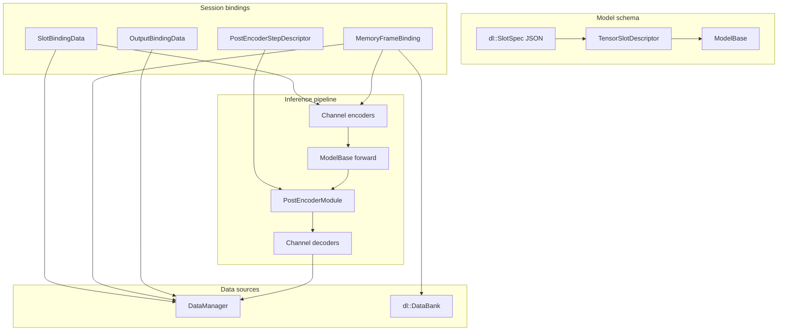

## Overview

This glossary clarifies terminology used across the DeepLearning library
(`src/DeepLearning`) and the Deep Learning widget (`src/WhiskerToolbox/DeepLearning_Widget`).
Several terms overlap with Qt or other domains; the tables below distinguish them.

Use this document when reading binding code, widget state, or model metadata —
especially the distinction between **model schema** (what the network expects) and
**session bindings** (where the user's data comes from and goes to).

## Glossary

| Term in code | What it means | What it is **not** |
|---|---|---|
| **Tensor slot** (`TensorSlotDescriptor`, `slot_name`) | A **named model I/O tensor** (e.g. `encoder_image`, `features`) with shape, dtype, and encoder/decoder hints — declared by `ModelBase` | Qt signal/**slot** callback |
| **`dl::SlotSpec`** | JSON schema for one tensor slot in [`RuntimeModelSpec`](runtime/RuntimeModelSpec.hpp) (`name`, `shape`, `recommended_encoder`, …) | User session wiring |
| **`dl::ModelInfo`** | Torch-free aggregated metadata for a model (slots, `batch_mode`, `recommended_post_encoder`) from `ModelRegistry` or `SlotAssembler::currentModelInfo()` | A loaded model instance |
| **Binding** | Persisted session config describing **how DataManager / DataBank data maps to/from model tensor slots** at inference time | Qt data-binding |
| **`SlotBindingData`** | Binding for a **dynamic** (per-frame) input slot: `data_key`, `EncoderVariant`, `time_offset` | A memory-frame position |
| **`MemoryFrameBinding`** | Binding for one **position** along a static/memory input slot: static (DataManager/DataBank) or recurrent feedback | The old separate `RecurrentBindingData` type (removed) |
| **`OutputBindingData`** | Binding for a model output slot: `data_key`, `DecoderVariant` | — |
| **`PostEncoderStepDescriptor`** | Session config for the optional post-encoder stage: `module_key` + `parameters_json` | Part of any specific model class |
| **Channel encoder** (`ImageEncoder`, `Point2DEncoder`, …) | Converts Neuralyzer geometry / media into tensor channels during `assembleInputs()` | The neural-network backbone (`GeneralEncoderModel`, etc.) |
| **Channel decoder** (`TensorToMask2D`, `TensorToPoint2D`, …) | Converts output tensor channels into DataManager types during `decodeOutputs()` | Post-encoder module |
| **Post-encoder module** (`PostEncoderModule`, `global_avg_pool`, …) | Optional **torch-to-torch** stage after `ModelBase::forward()`, before channel decoders; configured per session on `SlotAssembler` | Built into `GeneralEncoderModel` |
| **Memory input / static input** | Model input slot with `is_static = true`; configured via one or more `MemoryFrameBinding` rows | "Static" does not mean the tensor never changes — recurrent positions update each frame |
| **Dynamic input** | Per-frame input slot (`is_static = false`); configured via `SlotBindingData` | — |
| **Boolean mask slot** | Static input slot with `is_boolean_mask = true`; `MemoryFrameBinding::active` flags positions | A geometry mask in DataManager |
| **`memory_index`** | Position along a slot's `sequence_dim` (0 for single-frame memory slots) | A video frame index |
| **DataBank** (`dl::DataBank`) | Session store of geometry sources and pre-encoded tensors, independent of DataManager | DataManager itself |
| **DataBank capture** | Encode a DataManager frame into a named bank entry (`captureToBank`) for reuse | Automatic on every inference run |
| **Recurrent frame** | `MemoryFrameBinding` whose `frame_kind` is `RecurrentFrameSource`; output at frame *t* feeds input at *t+1* | A separate `recurrent_bindings` vector (removed) |
| **Effective output slots** | Output slot shapes after post-encoder shape propagation (`effectiveOutputSlots()`) | Raw `ModelBase::outputSlots()` when a post-encoder is active |
| **`SlotAssembler`** | Widget-layer bridge: assembles inputs, runs model + post-encoder, decodes outputs | Named after tensor slots, not Qt slots |

## Two configuration layers

| Layer | Location | Purpose |
|---|---|---|
| Model schema | `src/DeepLearning/models_v2/`, `runtime/` | What the model expects (slot names, shapes, batch mode, recommendations) |
| Session bindings | `src/DeepLearning/bindings/`, `DeepLearningState` | Where user data comes from / goes to; post-encoder choice |
| Widget bridge | `src/WhiskerToolbox/DeepLearning_Widget/Core/SlotAssembler.*` | Encode → forward → post-encoder → decode orchestration |

Persisted session state lives in `DeepLearningStateData`:

| Field | Binding type |
|---|---|
| `input_bindings` | `std::vector<SlotBindingData>` |
| `memory_frames` | `std::vector<dl::MemoryFrameBinding>` |
| `output_bindings` | `std::vector<OutputBindingData>` |
| `post_encoder_params` | `dl::PostEncoderStepDescriptor` |

## Input slot categories

Model input slots fall into three categories (see `TensorSlotDescriptor` flags):

| Category | Flag | Session config | Per-frame behavior |
|---|---|---|---|
| Dynamic | `is_static = false` | `SlotBindingData` per slot | Re-encode from DataManager each frame |
| Memory / static | `is_static = true`, not boolean | `MemoryFrameBinding` per position | Static positions: DataManager or DataBank; recurrent positions: feedback injection |
| Boolean mask | `is_boolean_mask = true` | `MemoryFrameBinding::active` per position | Sets 0/1 flags along a sequence axis |

Sequence slots (`sequence_dim >= 0`) use multiple `MemoryFrameBinding` rows with
distinct `memory_index` values for the same `slot_name`. Hybrid configurations
mix static and recurrent positions — see
[Hybrid Sequence Inputs](hybrid_sequence_inputs.qmd).

## Static and recurrent frame sources

Each memory position is configured via `MemoryFrameBinding::frame`:

| `frame_kind` | Variant | Behavior |
|---|---|---|
| Static | `DataManagerStaticSource` | Re-encode `data_key` at `current_frame + time_offset` |
| Static | `DataBankStaticSource` | Copy pre-encoded tensor from `bank_entry_id` |
| Recurrent | `RecurrentFrameSource` | Inject cached output from `output_slot_name`; seed at t=0 via `init` |

Access helpers (`isStaticFrame`, `hasActiveRecurrentBinding`, `resolvedBankEntryId`, …)
live in `DeepLearningBindingData.hpp`.

See [Memory Frame Bindings](bindings/memory_frames.qmd).

## Encoder and decoder variants

Session bindings store user-tunable channel encoder/decoder parameters as
reflect-cpp tagged unions:

| Union | Discriminator | Alternatives |
|---|---|---|
| `EncoderVariant` | `"encoder"` | `ImageEncoderParams`, `Point2DEncoderParams`, `Mask2DEncoderParams`, `Line2DEncoderParams` |
| `DecoderVariant` | `"decoder"` | `MaskDecoderParams`, `PointDecoderParams`, `LineDecoderParams`, `FeatureVectorDecoderParams` |

Factory string keys (e.g. `"ImageEncoder"`, `"TensorToMask2D"`) appear in model
slot descriptors and `EncoderFactory` / `DecoderFactory`; the tagged unions are
what gets serialized in workspace JSON.

## Post-encoder vs model

Post-encoder modules are **not** part of any `ModelBase` subclass. They are:

- Registered in `PostEncoderModuleRegistry` (`global_avg_pool`, `spatial_point`, …)
- Selected per session via `PostEncoderStepDescriptor`
- Applied by `SlotAssembler` to the **first output slot** after `forward()`
- Recommended per model via `ModelBase::recommendedPostEncoderModule()` (UI default only)

`ModelBase::outputSlots()` always reports raw model shapes. Decoders and output
binding widgets use **effective** shapes from `effectiveOutputSlots()` when a
post-encoder is configured.

See [Post-Encoder Modules](post_encoder_modules.qmd).

## Qt `slots` vs tensor slots

[`SlotAssembler`](../ui/DeepLearning_Widget/index.qmd) (`Core/SlotAssembler.hpp`) is named
after **model tensor slots**, not Qt slots. The widget uses a PIMPL pattern partly
because Qt's `#define slots` macro conflicts with libtorch's `slots()` member
function — an unrelated naming collision.

## Future naming

Type and field names may be revised in a later refactor (e.g. `tensor_feed/`,
`tensor_name` instead of `slot_name`) to reduce confusion for library consumers.
This document will be updated when that happens.

## See also

- [Deep Learning index](index.qmd) — library overview and pipeline
- [Memory Frame Bindings](bindings/memory_frames.qmd) — unified static/recurrent memory model
- [Slot Binding Types](bindings/slot_binding_types.qmd) — dynamic input and output bindings
- [DataBank](data_bank.qmd) — pre-encoded static tensor storage
- [Static Input Capture](static_input_capture.qmd) — DataManager vs DataBank sourcing
- [Recurrent Inputs](recurrent_inputs.qmd) — sequential feedback inference
- [Hybrid Sequence Inputs](hybrid_sequence_inputs.qmd) — mixed static/recurrent positions
- [Post-Encoder Modules](post_encoder_modules.qmd) — model-agnostic output processing
- [Session Constraints](constraints.qmd) — batch size and decoder consistency rules
