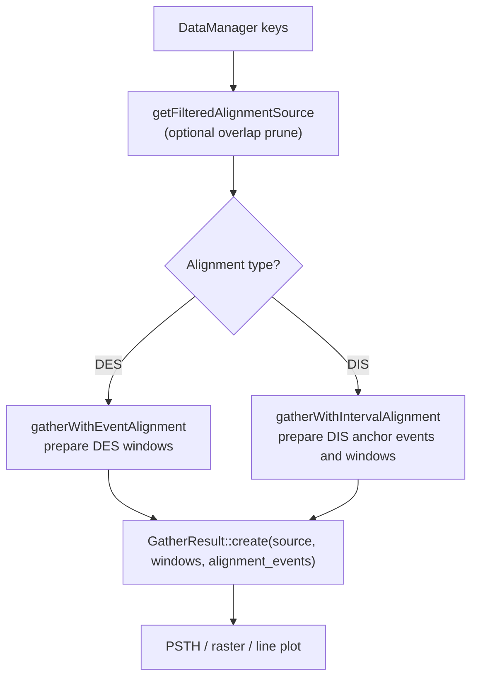

**Status:** Design / planned work (not yet implemented). Intended to be delivered in several small PRs.

This document captures the agreed architecture for **per-column gather geometry** in lazy-column tensors: how to build trial tables where different columns aggregate over different time regions tied to the same row source (e.g. spike presence in an onset window vs mean curvature over the full contact).

See also:

- [Tensor stack overview](../tensor_stack.qmd)
- [TensorColumnBuilders](../transforms_v2/TensorColumnBuilders.qmd)
- [TensorDesign library](TensorDesignBuilder.qmd)
- [DigitalIntervalSeries interval layouts](../DataObjects/DigitalTimeSeries/Digital_Interval_Series.qmd)
- [Whisker-contact scenario](../testing/scenarios/whisker_contact.qmd) (motivating integration test)

## Problem

A common analysis pattern (often done in Python) is:

1. **One row per trial** (e.g. each whisker `Contact` interval).
2. **Per-row features** that use *different* temporal windows:
   - Boolean: did a spike occur within ±W of contact **onset**?
   - Covariate: `Angle` sampled at contact **onset** (not mean over the whole contact).
3. **Downstream**: bin the covariate and estimate P(spike | bin) — that aggregation is *not* part of tensor building.

Today, `ColumnRecipe` + `buildIntervalPipelineProvider` always gather source data over the **full row interval**. Onset windows, point samples, and lagged intervals are not expressible in JSON without custom C++ glue per column.

## Design principle: pipelines, not parallel abstractions

Avoid a parallel type system (`ColumnAnchorSpec`, gather-mode enums, etc.). The library already has the right primitive: **TransformV2 pipelines**.

**Contract (per column):**


| Stage | Role |
|-------|------|
| **Row source** | Defines *which trials exist* and `RowDescriptor` metadata (e.g. `Contact` intervals). |
| **`row_pipeline_json`** | Optional TransformV2 pipeline on the row `DigitalIntervalSeries`. **Default: identity** (empty steps). Output is **gather geometry** for this column only. |
| **`pipeline_json`** | Existing source pipeline: gather within that geometry + range reduction (or passthrough sample). |

**Row identity is unchanged:** row `i` always refers to contact `i`. The row pipeline only changes *where this column looks* when reading `source_key` — not the row count.

## Row identity vs gather geometry

| Concept | Source | Example |
|---------|--------|---------|
| Row identity | `row_source` in `TensorDesignSpec` | `Contact` interval `i` |
| Gather geometry (per column) | `row_pipeline_json` output | Onset ±150 Master ticks around contact `i` |
| Feature value | `pipeline_json` on `source_key` | `EventPresence`, `MeanValue`, passthrough sample |

Different columns on the same tensor can share one row source but use different `row_pipeline_json` values.

## Mapping analysis patterns to transforms

Instead of new tensor enums, encode behavior as **composed transforms**:

| Intent | `row_pipeline_json` (conceptual) | `pipeline_json` |
|--------|----------------------------------|-----------------|
| Mean over full contact | identity (omit field) | `MeanValue` |
| Spike in onset ±W | `IntervalWindowAtAlignment(start, pre, post, time_key)` → gather geometry | `EventPresence` |
| Angle at onset | `IntervalToEventAtAnchor(start)` → DES | empty (passthrough sample at event times) |
| Stats on lagged contact | `IntervalShift(δ)` → DIS (output `Overlapping` unless source disjoint) | any reduction |
| Peak-aligned row times | `AnalogIntervalPeak` (existing, DIS+Analog→DES) | passthrough on another source |
| Trial-relative spike count | identity or window transform | `NormalizeEventTimeValueV2` + `EventCountInWindow` |

**Lag / lead** are not a separate abstraction:

- Lead covariate by N → point/event at `anchor` with shift, or `IntervalShift(-N)`.
- Post-onset-only window → asymmetric window params (`pre=0`, `post=W`).

**Data-derived alignment** (e.g. first spike in contact, peak curvature) → existing or new **binary** row transforms that output `DigitalEventSeries` (one event per row), such as [`AnalogIntervalPeak`](../transforms_v2/architecture.qmd).

**Optimal lag / time warping** → future TransformsV2 algorithms composed in `pipeline_json`; not part of the tensor gather contract.

## Relationship to existing code

| Component | Today | After row pipeline |
|-----------|-------|-------------------|
| [`buildIntervalPipelineProvider`](../../src/TransformsV2/core/TensorColumnBuilders.hpp) | Gather over row DIS as-is | Used when `row_pipeline` output is DIS (1:1 with rows) |
| [`buildPipelineColumnProvider`](../../src/TransformsV2/core/TensorColumnBuilders.hpp) | Timestamp-row columns | Used when `row_pipeline` output is DES (sample at event times) |
| Prepared windows + alignment events | Plotting / GatherResult | `DigitalIntervalSeries` bounds plus companion `DigitalEventSeries` anchors |
| [`PlotAlignmentGather`](../../src/WhiskerToolbox/Plots/Common/PlotAlignmentGather.hpp) | Qt plot widgets (PSTH, raster, line) | Same geometry as row pipeline; see [audit below](#plotalignmentgather-audit) |
| [`EventIntervalReduction`](../../src/TransformsV2/algorithms/IntervalReduction/IntervalReduction.hpp) | Fused identity + gather+reduce | Stays for one-shot pipelines; tensor columns stay **split** for composability |
| [`interval_property`](../../src/TransformsV2/core/TensorColumnBuilders.hpp) on `ColumnRecipe` | Row metadata only | Unchanged (no source gather) |
| `IntervalLayout::Overlapping` on [`DigitalIntervalSeries`](../../src/DataObjects/DigitalTimeSeries/Digital_Interval_Series.hpp) | Implemented | Row-pipeline gather geometry output type |

## PlotAlignmentGather audit

[`PlotAlignmentGather.hpp`](../../src/WhiskerToolbox/Plots/Common/PlotAlignmentGather.hpp) is the plotting stack’s entry point for “take an alignment series, pick onset/offset (or event time), expand a window, gather source data.” It prepares `DigitalIntervalSeries` windows and companion `DigitalEventSeries` alignment events before calling [`GatherResult::gather`](../../src/GatherResult/GatherResult.hpp).

### Data flow (today)



| Plot API | Prepared metadata | Gather bounds | Alignment time |
|----------|---------|---------------|----------------|
| `gatherWithEventAlignment` | prepared windows + original DES anchors | `[T−pre, T+post]` per event | event time `T` |
| `gatherWithIntervalAlignment` (no window) | original DIS + extracted DES anchors | raw interval `[start, end]` | start / end / center index |
| `gatherWithIntervalAlignment` (+ window) | prepared windows + extracted DES anchors | `[align_abs−pre, align_abs+post]` | anchor converted to absolute time |
| `createAlignedGatherResult` | dispatches above | `window_size/2` symmetric pre/post | from `PlotAlignmentData` |

**Important:** event/interval windows are materialized as `DigitalIntervalSeries` values. Use [`createOverlapping()`](../../src/DataObjects/DigitalTimeSeries/Digital_Interval_Series.hpp) for gather geometry so each row `i` maps to one window even when windows overlap in absolute time.

### Overlap pruning (plot-only, optional)

When `PlotAlignmentData.prevent_overlap` is true, `getFilteredAlignmentSource` runs **before** gather:

1. Extract absolute alignment times (`extractAlignmentTimes` from DES, or anchor times from DIS).
2. Greedy left-to-right prune (`pruneOverlappingAlignmentTimes`) on expanded windows `[t−pre, t+post]`.
3. Filter the alignment series to kept indices (`createFilteredEventSeries` / `createFilteredIntervalSeries`).

This **drops trials** (reduces row count). It is a UI/analysis choice for PSTH-style displays, not a storage invariant. Default: `prevent_overlap = false` — overlapping windows are allowed and spikes in the overlap region appear in multiple trial views (correct for a raw per-trial raster).

### Gap vs tensor path

| | Plot (`PlotAlignmentGather`) | Tensor (today) | Tensor (after row pipeline) |
|--|------------------------------|----------------|------------------------------|
| Geometry | Prepared `Overlapping` DIS + optional anchor DES | Materialized `Disjoint` DIS | Materialized **`Overlapping`** DIS + anchor DES |
| Onset window around DIS | Interval anchor extraction + event-window preparation | **Not yet** — needs `row_pipeline_json` | Transform outputs bounds DIS + anchor DES |
| Overlapping windows | Supported via [`createOverlapping()`](../../src/DataObjects/DigitalTimeSeries/Digital_Interval_Series.hpp) | Was risky on `Disjoint` DIS | **Supported** via [`createOverlapping()`](../../src/DataObjects/DigitalTimeSeries/Digital_Interval_Series.hpp) |
| Cross-timeframe | `GatherResult::create` converts prepared window TF → source TF | `GatherResult` converts DIS query bounds with `convertTimeFrameRange()` | Same; row interval metadata stays in original coordinates |

PR 3 should materialize row-pipeline DIS output as **`Overlapping`** when windows may overlap and pass a companion anchor DES when alignment metadata is needed.

## Proposed API change (minimal)

Add **one** optional field to [`ColumnRecipe`](../../src/TransformsV2/core/TensorColumnBuilders.hpp):

```cpp
struct ColumnRecipe {
    std::string column_name;
    std::string source_key;
    std::string pipeline_json;       // source gather + reduce (existing)
    std::string row_pipeline_json;   // NEW: row DIS → geometry (default "")
    std::optional<IntervalProperty> interval_property;
};
```

`buildProviderFromRecipe` dispatch (sketch):

1. If `interval_property` → existing path.
2. Execute `row_pipeline_json` on shared row `DigitalIntervalSeries` (empty ⇒ identity).
3. By output type:
   - Gather geometry / `DigitalIntervalSeries` (same row count, `IntervalLayout::Overlapping` when windows may overlap) → `buildIntervalPipelineProvider`.
   - `DigitalEventSeries` (one event per row) → extract times → `buildPipelineColumnProvider`.
4. Binary row steps (e.g. `AnalogIntervalPeak`) use `additional_input_keys` in the pipeline descriptor JSON (same as other binary transforms).

Remove the fragile `"offset"` substring hack in [`TensorDesignBuilder`](../../src/TensorDesign/TensorDesignBuilder.cpp) once point sampling is expressible via row pipeline.

## Proposed JSON (whisker-contact tuning table)

**Not valid until implemented.** Illustrates the target envelope:

```json
{
  "tensor_key": "contact_onset_features",
  "row_source": {
    "data_key": "Contact",
    "row_type": "interval"
  },
  "columns": [
    {
      "name": "mean_curvature",
      "source_key": "Curvature",
      "pipeline_json": "{\"steps\": [], \"range_reduction\": {\"reduction_name\": \"MeanValue\"}}"
    },
    {
      "name": "spike_in_window",
      "source_key": "Spikes",
      "row_pipeline_json": "{\"steps\": [{\"transform_name\": \"IntervalWindowAtAlignment\", \"parameters\": {\"alignment\": \"start\", \"pre\": 150, \"post\": 150, \"time_key\": \"Master\"}}]}",
      "pipeline_json": "{\"steps\": [], \"range_reduction\": {\"reduction_name\": \"EventPresence\"}}"
    },
    {
      "name": "angle_at_onset",
      "source_key": "Angle",
      "row_pipeline_json": "{\"steps\": [{\"transform_name\": \"IntervalToEventAtAnchor\", \"parameters\": {\"anchor\": \"start\"}}]}",
      "pipeline_json": "{\"steps\": []}"
    }
  ]
}
```

Omitted `row_pipeline_json` ⇒ identity (backward compatible with current designs).

### Window units

`time_key` on transform parameters names the clock for `pre` / `post` / `offset`:

| `time_key` | ±150 means (whisker scenario) |
|------------|----------------------------------|
| `"Master"` | 150 samples at 30 kHz |
| `"Time"` | 150 camera frames → 9000 master ticks (60×) |

Empty or row-source default ⇒ use the row interval series' `TimeFrame`.

## Transforms to add (TransformsV2)

New behavior should land as **small registered transforms**, not tensor-layer enums:

| Transform | Signature | Purpose |
|-----------|-----------|---------|
| `IntervalWindowAtAlignment` | DIS → gather geometry | Fused `IntervalToEventAtAnchor` + `EventWindowExpand`; outputs `Overlapping` DIS |
| `IntervalToEventAtAnchor` | DIS → DES | One event per row at start / end / center |
| `EventWindowExpand` | DES → gather geometry | ±pre/post per event; may output `Overlapping` DIS |
| `IntervalShift` | DIS → DIS | Lag/lead; output `Overlapping` unless input geometry is disjoint |
| `PruneOverlappingAlignmentWindows` | geometry → geometry | Optional; mirrors `prevent_overlap` in plots |

`IntervalWindowAtAlignment` should materialize an **`Overlapping`** `DigitalIntervalSeries` of gather bounds. When alignment time differs from window start (onset ±W), reductions that need `alignment_time` should receive a companion `DigitalEventSeries` of anchors or a gather-executor extension — see [Alignment metadata gap](#alignment-metadata-gap) below.

### Composing transforms (interval → event → interval)

Plot alignment is already expressible as a **two-step row pipeline** without new top-level tensor concepts:

| Plot pattern | Row pipeline (composed) | Notes |
|--------------|-------------------------|-------|
| Onset ±W around contact | `IntervalToEventAtAnchor(start)` → `EventWindowExpand(pre, post)` | Same prepared geometry as plot interval-start alignment |
| Offset ±W | `IntervalToEventAtAnchor(end)` → `EventWindowExpand` | |
| Center ±W | `IntervalToEventAtAnchor(center)` → `EventWindowExpand` | |
| Align to DES, ±W | `EventWindowExpand` only (identity on row if row is already DES) | Same prepared geometry as plot event alignment |
| Lagged contact window | `IntervalShift(δ)` → optional window expand | Shift before or after anchor extraction; `IntervalShift` output is `Overlapping` when source windows can overlap |

`EventWindowExpand` is the DES-side event-window transform: it produces gather geometry (one window per event) without merging. It should output an **`Overlapping`** `DigitalIntervalSeries` when materialized.

**Simplification opportunity:** `PlotAlignmentGather`’s four gather overloads + `createAlignedGatherResult` could eventually delegate to the same row-pipeline descriptors the tensor uses, with `prevent_overlap` modeled as an optional trailing transform (`PruneOverlappingAlignmentWindows`) instead of bespoke C++ in the plot header. That keeps one geometry vocabulary for plots and tensors.

## Overlap: `DigitalIntervalSeries` contract vs gather geometry

[`DigitalIntervalSeries`](../../src/DataObjects/DigitalTimeSeries/Digital_Interval_Series.hpp) now distinguishes semantic row sources from gather geometry via construction-time **`IntervalLayout`** (see [interval layouts](../DataObjects/DigitalTimeSeries/Digital_Interval_Series.qmd)).

### Two roles, two layouts

| Role | `IntervalLayout` | Overlap in time? | Example |
|------|------------------|------------------|---------|
| **Row source** (semantic trials) | `Disjoint` | No — merged on `addEvent` | `Contact`, `Trial` in DataManager |
| **Gather geometry** (per-column bounds) | `Overlapping` | Yes — row `i` → interval `i` | Onset ±W windows, transform pipeline output |

Row source stays `Disjoint`. Row-pipeline output that may overlap should use **`DigitalIntervalSeries::createOverlapping()`** (or `createFromView()`, which defaults to `Overlapping`).

[`GatherResult`](../../src/GatherResult/GatherResult.hpp) consumes prepared `DigitalIntervalSeries` windows directly and can store companion `DigitalEventSeries` alignment events for trial-relative metadata.

### Materializing gather windows into DIS

**Safe** when:

- Series is `IntervalLayout::Overlapping`
- Built via `createOverlapping()` or `addEvent` on an overlapping series
- Row count verified: `geometry.size() == row_source.size()`

**Still unsafe / wrong:**

- `addEvent` on a default `Disjoint` series (merges overlapping intervals)
- Using `Overlapping` DIS for interactive `setEventAtTime` editing (`Disjoint` only)
- Assuming O(log n) `getOverlappingRange` on overlapping series (uses O(n) linear scan)

**Footguns:**

- The vector constructor (`DigitalIntervalSeries(std::vector<Interval>)`) defaults to `Disjoint` layout but bulk-inserts without merging — prefer `createOverlapping()` for geometry.
- `copyByEntityIds` into a `Disjoint` target still merges on `addEvent`.
- [`DigitalIntervalBoolean`](../../src/TransformsV2/algorithms/DigitalIntervalBoolean/DigitalIntervalBoolean.cpp) merges internally regardless of layout.

### Alignment metadata gap {#alignment-metadata-gap}

`Overlapping` DIS solves **bounds overlap**, not **alignment anchor** metadata:

- Window gather: bounds `[anchor − pre, anchor + post]`, alignment `anchor`
- `GatherResult::alignmentTimeAt()` falls back to `interval.start` for direct DIS gather

Options for row pipeline / tensor when anchor ≠ window start:

1. Output a `DigitalEventSeries` of anchors + `EventWindowExpand` (composed row pipeline)
2. Extend the gather executor with per-row alignment events alongside an `Overlapping` DIS

### Alternatives considered

| Option | Verdict |
|--------|---------|
| `IntervalLayout::Overlapping` | **Implemented** — use for gather geometry and transform intermediates |
| Lazy `IntervalSource` only | **Removed** — prepared DIS windows are the standard gather geometry |
| New DataManager type (e.g. `TrialWindowSeries`) | **Defer** — only if we need to persist overlapping windows |
| Always prune overlaps in tensor builder | **Reject** — silently drops contacts; wrong for tuning-curve tables |
| Store windows only in plot code | **Reject** — duplicates logic; row pipeline unifies plot + tensor |

## What stays out of scope

- Binned P(spike | covariate) — downstream (export tensor, Python, future `GroupBy`).
- Non-linear time warping — dedicated transforms or preprocessing.
- UI (`ColumnConfigDialog`) — follow after library + tests stabilize.

## Incremental PR plan

Work is intentionally split so each PR is reviewable and shippable independently.

### PR 1 — Design doc only (this document)

- Capture architecture and PR roadmap.
- No code changes.

### PR 2 — Interval geometry transforms

- Add `IntervalToEventAtAnchor`, `EventWindowExpand`, `IntervalWindowAtAlignment` (fused), `IntervalShift`, optional `PruneOverlappingAlignmentWindows` under `src/TransformsV2/algorithms/`.
- Window transforms produce gather geometry; default to **`Overlapping`** DIS when materialized. Tests assert row count is preserved under overlapping windows.
- Register container transforms; unit tests per transform.
- No `ColumnRecipe` or tensor builder changes yet.

### PR 3 — `row_pipeline_json` wiring

- Add `row_pipeline_json` to `ColumnRecipe`; parse/serialize in `TensorDesign`.
- Implement dispatch in `buildProviderFromRecipe` (identity, `Overlapping` DIS out, DES out).
- Wire `Overlapping` DIS into existing `buildIntervalPipelineProvider`; `GatherResult` handles source-TimeFrame query conversion.
- Remove `"offset"` hack in `TensorDesignBuilder::buildColumnProvider`.
- Tests in `test_tensor_column_builders` / `test_tensor_design`.

### PR 4 — Whisker-contact integration + docs

- Extend [whisker-contact scenario](../testing/scenarios/whisker_contact.qmd) with onset-window / angle-at-onset example.
- Update [TensorColumnBuilders](../transforms_v2/TensorColumnBuilders.qmd) and [TensorDesignBuilder](TensorDesignBuilder.qmd) with `row_pipeline_json` once implemented.

### PR 5 (optional) — UI

- `ColumnConfigDialog` / `TensorDesigner` support for row pipeline JSON or preset transforms.

## Current state summary

| Capability | Status |
|------------|--------|
| Row = interval / event / derived timestamps | Implemented |
| Full-interval gather + reduction per column | Implemented |
| Cross-timeframe gather (`GatherResult` query-bound conversion) | Implemented |
| `IntervalLayout` (`Disjoint` / `Overlapping`) on DIS | **Implemented** |
| Overlap-safe materialized gather geometry (`createOverlapping`) | **Implemented** (DIS); tensor wiring **Planned** |
| Per-column `row_pipeline_json` | **Planned** |
| Interval geometry transforms | **Planned** |
| Lazy gather geometry via `IntervalSource` adapters | **Removed**; prepared DIS windows are the standard gather geometry |
| Onset-window + tuning-curve tensor via JSON | **Planned** (PR 3–4) |

## Open questions (for future PRs)

- Should `row_pipeline_json` allow binary transforms with `additional_input_keys` referencing arbitrary DM keys, or only keys declared on the column?
- Shared row-pipeline presets at tensor level (all columns inherit unless overridden) — defer unless a concrete use case appears.
- Caching: if many columns share the same `row_pipeline_json`, memoize transformed geometry per materialization pass.
- When row pipeline outputs window bounds as `Overlapping` DIS, where is `alignment_time` stored for `NormalizeEventTimeValueV2` — companion DES column, pipeline params, or gather executor extension?
- If materialized converted row geometry is needed later, should it preserve `IntervalLayout::Overlapping` explicitly or remain a query-only `GatherResult` concern?
- Plot refactor: when to migrate `PlotAlignmentGather` to shared row-pipeline descriptors (PR 5+).
