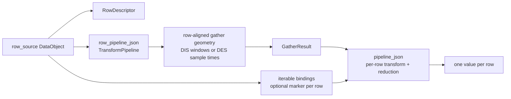

**Status:** Partially implemented. GatherResult, interval-window primitives, `ColumnRecipe::row_pipeline_json`, TensorDesign JSON round-trip, identity row-pipeline dispatch, and `DigitalIntervalSeries` row-pipeline gather windows are implemented. `PipelineValueStore` iterable bindings, timestamp/sample row-pipeline dispatch, presets, and UI support remain planned.

This document describes the target architecture for per-column gather geometry in lazy-column tensors. The implementation sequence is tracked separately in [Column Row Pipeline Roadmap](column_row_pipeline_roadmap.qmd).

See also:

- [Tensor stack overview](../tensor_stack.qmd)
- [TensorDesign library](TensorDesignBuilder.qmd)
- [TensorColumnBuilders](../transforms_v2/TensorColumnBuilders.qmd)
- [GatherResult row-aligned container design](../GatherResult/row_aligned_dataobject_container_design.qmd)
- [DigitalIntervalSeries interval layouts](../DataObjects/DigitalTimeSeries/Digital_Interval_Series.qmd)
- [Whisker-contact scenario](../testing/scenarios/whisker_contact.qmd)

## Goal

TensorDesign should support feature tables where every row comes from one row source, but each column can choose a different row-aligned temporal geometry before gathering its source data.

The motivating table is:

- One row per whisker `Contact` interval.
- A curvature column reduced over the full contact interval.
- A spike column reduced over a short window around contact onset.
- An angle column sampled at contact onset.
- Downstream analysis, such as binning angle and estimating `P(spike | bin)`, remains outside tensor building.

The design should use existing project primitives instead of tensor-specific interval abstractions:

- DataObjects carry `TimeFrame` and entity identity.
- TransformPipelines mutate or derive DataObjects.
- `GatherResult` stores gathered row DataObjects plus prepared window metadata when direct gathering is needed.
- TensorDesign assembles the row source, column recipes, lazy providers, and output `TensorData`.

## Current State

Implemented today:

- `TensorDesign` can build lazy-column tensors from interval, timestamp, and derived timestamp row sources.
- Interval-row columns gather over the full row interval.
- `ColumnRecipe::pipeline_json` describes source processing and interval range reductions.
- `ColumnRecipe::row_pipeline_json` is parsed, serialized, and used for interval-row gather geometry.
- `ColumnRecipe::interval_property` provides row metadata columns such as interval start, end, and duration.
- Empty or whitespace `row_pipeline_json` and explicit empty-step descriptors are treated as identity row geometry.
- Non-identity interval-row pipelines may produce row-aligned `DigitalIntervalSeries` prepared windows.
- TensorDesign verifies row-pipeline window output preserves the original row count.
- Digital event/interval iteration exposes `ClockTicks` API-facing values, so cross-timeframe temporal math should happen in clock-tick coordinates rather than raw `TimeFrameIndex` coordinates.
- `PipelineValueStore` can store `ClockTicks`, and `NormalizeTimeParamsV2::alignment_time` is a `ClockTicks` value.
- `GatherResult` consumes prepared `DigitalIntervalSeries` windows and can hold companion alignment events, but TensorDesign should not rely on that metadata path for column transformations.
- `GatherResult` converts prepared window bounds to the gathered source `TimeFrame` with `convertTimeFrameRange()`.
- `DigitalIntervalSeries` supports `IntervalLayout::Overlapping` through `createOverlapping()`.
- `IntervalToEvent`, `EventToInterval`, and `PruneOverlappingIntervals` are registered TransformsV2 algorithms.

Not implemented yet:

- `DigitalEventSeries` row-pipeline output dispatch for timestamp/sample columns.
- TensorDesign column recipe support for iterable bindings from row-aligned DataObjects into `PipelineValueStore`.
- Replacement of the temporary `pipeline_json` `"offset"` sample-at-offset compatibility path.
- Row-pipeline caching across columns.
- Preset registry, bundled preset library, and preset expansion.
- UI support for configuring row pipelines.

## Problem

Original interval-row tensor columns always gathered source data over the full row interval. With the implemented `DigitalIntervalSeries` row-pipeline path, onset-window event reductions are now expressible in TensorDesign JSON. Remaining gaps are point sampling, per-row normalization context, presets, and UI.

The full design addresses these common per-row features:

- Spike presence within `[-W, +W]` of contact onset.
- Analog value sampled at contact onset.
- Statistics over a lagged or shifted version of the row interval.
- Statistics aligned to a data-derived point inside a row, such as a peak curvature time.

Adding tensor-specific fields such as `lag`, `window_start`, or `gather_mode` would duplicate the TransformPipeline and DataObject systems. Those systems already handle TimeFrame conversion and entity identity, which are core requirements for correct scientific analysis.

## Core Model

The target per-column data flow is:



`row_source` defines row identity. `row_pipeline_json` defines where a column looks for data. `pipeline_json` defines how the gathered source data becomes a column value.

The invariant is that row `i` remains row `i`. A row pipeline may change the gather bounds or sample time for row `i`, but it must not silently reorder rows, merge rows, or create extra rows unless the column builder explicitly supports that behavior.

## Responsibilities

| Component | Responsibility |
|---|---|
| DataObjects | Store data, `TimeFrame`, entity IDs, view/copy semantics, and materialization behavior. |
| TransformsV2 row pipeline | Derive row-aligned gather inputs from the row source, such as windows or sample times. |
| `GatherResult` | Gather source rows from prepared windows. It does not execute TransformPipelines or own per-row column context. |
| TransformsV2 iterable binding | Maps one element per row from a DataObject iterable into `PipelineValueStore` keys. |
| `pipeline_json` | Processes gathered source rows with `PipelineValueStore` parameter bindings and produces a scalar column value or supported DataObject output. |
| TensorDesign | Parse recipes, build row descriptors, connect row pipelines to column providers, and assemble `TensorData`. |

This keeps the dependency direction aligned with the GatherResult refactor:

```text
TensorDesign / TransformsV2 extensions -> GatherResult -> DataObjects
```

not:

```text
GatherResult -> TensorDesign or TransformPipeline execution
```

## Row Identity And Gather Inputs

| Concept | Defined by | Example |
|---|---|---|
| Row identity | `TensorDesignSpec::row_source` | `Contact` interval `i` |
| Row descriptor | Original row source | Contact start/end metadata |
| Gather windows | `row_pipeline_json` output or identity row source | Trial window or onset window around contact `i` |
| Sample times | `row_pipeline_json` output, when sampling | Contact onset event for row `i` |
| Iterable binding values | DataManager object or row-pipeline output | `ClockTicks` for raster/PSTH row `i` |
| Feature value | `pipeline_json` over gathered source rows | Spike presence, mean curvature, angle sample |

Prepared windows should be represented as `DigitalIntervalSeries`. Per-row sample times should be represented as `DigitalEventSeries`. These are normal DataObjects, not tensor-specific side channels.

When a column needs to normalize gathered data relative to a marker that is not the gather window start, that marker should be supplied through `PipelineValueStore` parameter binding for `pipeline_json`, not encoded as a second output of `row_pipeline_json`.

For example, a spike raster column may gather spikes inside each trial window, then run a normalize-time transform with the contact onset event for that row supplied through the value store as `ClockTicks`.

## Transform Composition

TensorDesign should express per-column geometry through composed registered transforms rather than new tensor enums.

| Intent | Row pipeline output | Source pipeline |
|---|---|---|
| Mean over full contact | Identity row `DigitalIntervalSeries` | Range reduction such as `MeanValue` |
| Spike near onset | `IntervalToEvent(start)` sample times followed by `EventToInterval(pre, post)` windows | Event presence or event count reduction |
| Angle at onset | `IntervalToEvent(start)` sample times | Sample-at-event provider or equivalent source transform |
| Raster/PSTH over trials | Trial windows from identity row source | Normalize event times with one marker per row, then count/bin/export |
| Lagged contact statistic | `IntervalShift(delta)` windows | Any interval reduction |
| Peak-centered feature | Data-derived row transform producing one event per row | Sample or windowed reduction around that event |

Implemented transforms that should be reused:

| Transform | Status | Role |
|---|---|---|
| `IntervalToEvent` | Implemented | Extract start, end, or center events from interval rows. |
| `EventToInterval` | Implemented | Expand events into overlapping gather windows. |
| `PruneOverlappingIntervals` | Implemented | Optional keep-first pruning when a caller explicitly wants to drop overlapping windows. |

Potential future transforms should be added only when there is a concrete use case:

| Transform | Need |
|---|---|
| `IntervalShift` | Lag or lead a row interval while preserving row count. |
| Data-derived event transforms | Produce one event per row from a row object plus another source object. |
| Fused convenience transforms | Optional wrappers around common compositions; they should still return normal DataObjects. |

## Proposed Recipe Shape

The minimal API extension is one optional field on `ColumnRecipe`:

```cpp
struct ColumnRecipe {
    std::string column_name;
    std::string source_key;
    std::string pipeline_json;
    std::string row_pipeline_json;
    std::optional<IntervalProperty> interval_property;
};
```

An omitted or empty `row_pipeline_json` means identity: use the original row source as the gather geometry.

For interval row sources, identity means the existing full-interval behavior. This preserves current JSON designs.

## Proposed JSON

Raw row-pipeline JSON is the low-level target shape and is not valid until `row_pipeline_json` support is implemented:

```json
{
  "tensor_key": "contact_onset_features",
  "row_source": {
    "data_key": "Contact",
    "row_type": "interval"
  },
  "columns": [
    {
      "name": "mean_curvature",
      "source_key": "Curvature",
      "pipeline_json": "{\"steps\": [], \"range_reduction\": {\"reduction_name\": \"MeanValue\"}}"
    },
    {
      "name": "spike_in_window",
      "source_key": "Spikes",
      "row_pipeline_json": "{\"steps\": [{\"transform_name\": \"IntervalToEvent\", \"parameters\": {\"point\": \"start\"}}, {\"transform_name\": \"EventToInterval\", \"parameters\": {\"pre_expansion\": 150, \"post_expansion\": 150}}]}",
      "pipeline_json": "{\"steps\": [], \"range_reduction\": {\"reduction_name\": \"EventPresence\"}}"
    },
    {
      "name": "angle_at_onset",
      "source_key": "Angle",
      "row_pipeline_json": "{\"steps\": [{\"transform_name\": \"IntervalToEvent\", \"parameters\": {\"point\": \"start\"}}]}",
      "pipeline_json": "{\"steps\": []}"
    }
  ]
}
```

`row_pipeline_json` describes only the row-aligned gather or sample input. The `DigitalIntervalSeries` gather-window form shown above is implemented. `DigitalEventSeries` sample-time output remains planned. `row_pipeline_json` should not also be responsible for carrying a separate normalization marker. If a column needs one marker per row for a transform such as normalize-time, that marker should be loaded into `PipelineValueStore` during per-row `pipeline_json` execution.

## JSON Authoring Levels

The raw schema is functional but not friendly: users should not need to remember transform names, parameter names, `PipelineValueStore` keys, or binding syntax for common analyses. TensorDesign should support multiple authoring levels that all expand to the same low-level column recipe model.

### Level 1: Presets

Presets are the preferred user-facing format for common analysis patterns. They name the intent and expose only the parameters a user should edit.

Example: spike presence around interval onset:

```json
{
  "name": "spike_in_onset_window",
  "preset": "event_presence_around_interval_start",
  "source_key": "Spikes",
  "parameters": {
    "pre": 150,
    "post": 150
  }
}
```

Example: raster/PSTH events normalized to interval onset:

```json
{
  "name": "trial_relative_spikes",
  "preset": "raster_events_relative_to_interval_start",
  "source_key": "Spikes",
  "parameters": {
    "window": "row_interval"
  }
}
```

Presets should be backed by a registry, not hard-coded in UI code. The registry should expose display names, descriptions, parameter schemas, and an expansion function that produces the low-level `ColumnRecipe` fields.

Conceptual registry descriptor:

```cpp
struct ColumnRecipePresetDescriptor {
    std::string name;
    std::string display_name;
    std::string description;
    ParameterSchema parameters;
    std::function<ColumnRecipe(ColumnPresetArgs const &)> expand;
};
```

This matches existing project patterns: transforms and generators are registered, parameter schemas drive UI, and AutoParamWidget can render parameter forms.

### Level 2: Assisted Domain JSON

Assisted domain JSON is for advanced users who want readable JSON without writing full TransformPipeline descriptors. It uses domain terms such as row geometry, alignment point, and reduction, then expands to raw pipeline fields.

Example:

```json
{
  "name": "spike_in_onset_window",
  "source_key": "Spikes",
  "row_geometry": {
    "from": "row_interval",
    "point": "start",
    "window": {
      "pre": 150,
      "post": 150
    }
  },
  "reduction": {
    "name": "EventPresence"
  }
}
```

This level is optional. It should be added only if presets are too restrictive but raw JSON remains too verbose for common scripted workflows.

### Level 3: Raw Pipeline JSON

Raw pipeline JSON is the developer and power-user format. It directly specifies `row_pipeline_json`, iterable `PipelineValueStore` bindings, and `pipeline_json`.

Example:

```json
{
  "name": "trial_relative_spikes",
  "source_key": "Spikes",
  "row_pipeline_json": "{\"steps\": []}",
  "pipeline_value_bindings": [
    {
      "source_key": "ContactOnset",
      "store_key": "row_alignment_time"
    }
  ],
  "pipeline_json": "{\"steps\": [{\"transform_name\": \"NormalizeTime\", \"param_bindings\": {\"alignment_time\": \"row_alignment_time\"}}]}"
}
```

The raw format should remain stable because it is the execution interchange format and the best target for focused tests.

### Saved Design Strategy

For user-facing saved designs, prefer storing both the user-authored preset and the expanded raw recipe:

```json
{
  "name": "spike_in_onset_window",
  "preset": {
    "name": "event_presence_around_interval_start",
    "version": 1,
    "parameters": {
      "source_key": "Spikes",
      "pre": 150,
      "post": 150
    }
  },
  "expanded": {
    "source_key": "Spikes",
    "row_pipeline_json": "...",
    "pipeline_json": "..."
  }
}
```

This preserves readability while keeping execution reproducible if a preset changes later. Early implementation may store only the expanded raw fields until preset versioning exists.

### Preset Library

TransformsV2 already has a [`PipelineLibrary`](../transforms_v2/pipeline_library.qmd) for user-saved `PipelineDescriptor` JSON files under:

```text
{config_dir}/pipelines/transforms_v2/*.json
```

Column recipe presets should reuse the same library pattern where it helps, but they are not identical to raw TransformPipeline descriptors. A column preset may expand to several fields: `source_key`, `row_pipeline_json`, `pipeline_value_bindings`, and `pipeline_json`. It may also include UI-facing parameter metadata. Therefore the preferred design is a sibling library for TensorDesign column presets rather than overloading the existing transform pipeline file format.

Proposed library layers:

| Layer | Purpose | Example location |
|---|---|---|
| Bundled presets | Presets distributed with Neuralyzer | `resources/presets/tensor_design/columns/*.json` |
| User presets | User-saved or imported column presets | `{config_dir}/presets/tensor_design/columns/*.json` |
| Raw TransformPipelines | Existing saved transform pipelines | `{config_dir}/pipelines/transforms_v2/*.json` |

The bundled preset directory gives users useful defaults immediately after installation. The user preset directory lets users save lab-specific recipes without modifying the installation.

A preset JSON file should be self-describing:

```json
{
  "schema": "neuralyzer.tensor_design.column_preset",
  "version": 1,
  "id": "event_presence_around_interval_start",
  "display_name": "Event presence around interval start",
  "description": "Gather events in a window around each row interval start and report whether any event occurred.",
  "parameters": [
    {"name": "source_key", "type": "data_key", "data_type": "DigitalEventSeries"},
    {"name": "pre", "type": "int", "default": 150},
    {"name": "post", "type": "int", "default": 150}
  ],
  "expansion": {
    "source_key": "${source_key}",
    "row_pipeline_json": "{\"steps\": [{\"transform_name\": \"IntervalToEvent\", \"parameters\": {\"point\": \"start\"}}, {\"transform_name\": \"EventToInterval\", \"parameters\": {\"pre_expansion\": ${pre}, \"post_expansion\": ${post}}}]}",
    "pipeline_json": "{\"steps\": [], \"range_reduction\": {\"reduction_name\": \"EventPresence\"}}"
  }
}
```

This can start as a simple JSON-template expansion system. If templates become too limited, the registry can later support compiled C++ expansion functions while preserving the same catalog metadata.

The preset catalog should merge bundled and user entries by `id`:

- Bundled presets provide defaults.
- User presets with the same `id` can either override bundled entries or be rejected; choose one policy and document it before implementation.
- Display should sort by `display_name`, with source badges such as `Built-in` and `User`.

This is intentionally similar to `PipelineLibrary`: list entries, load JSON, save user JSON, delete user JSON, import/export files. The difference is schema and expansion target, not the library mechanics.

## PipelineValueStore Iterable Binding

TransformsV2 already has the mechanism needed to inject runtime values into a `TransformPipeline`: `PipelineValueStore` plus parameter bindings loaded from pipeline JSON. GatherResult previously used this mechanism through TransformsV2 gather extension helpers such as `buildGatherRowStore()`.

The row-pipeline refactor should reuse that mechanism rather than adding TensorData-specific context plumbing. The missing piece is an iterable binding layer owned by TransformsV2 or the TensorColumnBuilders/TransformsV2 integration.

The core contract is:

1. A column recipe or pipeline descriptor identifies an iterable context source.
2. The source is a DataObject in `DataManager` or a DataObject produced by a row TransformPipeline.
3. The source has one row-aligned element per tensor row.
4. For row `i`, the iterable binding converts element `i` into the DataObject's default binding value and writes it into `PipelineValueStore` under the declared key.
5. `pipeline_json` parameter bindings map those store keys onto transform parameters.

This is conceptually equivalent to how the GatherResult extension previously created a per-row store, but the values are no longer limited to GatherResult metadata. Any row-aligned iterable DataObject can supply bound values.

Binding declarations should live on `ColumnRecipe`, beside `pipeline_json`. They should not be embedded in `PipelineDescriptor`, because the descriptor should remain a reusable transform pipeline that does not know about DataManager keys, tensor rows, or external iterable sources. All pipeline-valued fields, including `row_pipeline_json`, `source_pipeline_json`, and `pipeline_json`, should use the same `PipelineDescriptor` schema.

### Binding Source Options

There are two useful source forms.

Direct DataManager source:

```json
{
  "source_key": "ContactOnset",
  "store_key": "row_alignment_time"
}
```

DataManager source plus transform pipeline:

```json
{
  "source_key": "Contact",
  "source_pipeline_json": "{\"steps\": [{\"transform_name\": \"IntervalToEvent\", \"parameters\": {\"point\": \"start\"}}]}",
  "store_key": "row_alignment_time"
}
```

The second form covers the case where the iterable does not already exist as a DataManager object. The implicit default is identity: if `source_pipeline_json` is omitted or empty, use the DataObject referenced by `source_key` directly.

This keeps every binding grounded in a DataManager key while still allowing the iterable to be derived. It also makes testing straightforward: a direct-key test and a key-plus-transform test should produce the same `PipelineValueStore` values when the derived object is equivalent to a precomputed object.

### Binding Value Semantics

The user should not need to specify an extractor for the initial Phase 5 use case. Instead, each supported DataObject type should define a default binding value for one row element.

Initial support should be deliberately narrow:

| Source DataObject | Row element | Default binding value |
|---|---|---|
| `DigitalEventSeries` | `ClockTicksWithId` event row `i` | `event.time()` as `ClockTicks` |

If a caller needs interval start, end, or center as the bound value, it should first derive a `DigitalEventSeries` with `IntervalToEvent`. This avoids requiring users to choose coordinate extractors and keeps start/end/center selection in the TransformPipeline where it already belongs.

The ClockTicks refactor removes the need for binding declarations to carry `TimeFrame` pointers. `DigitalEventSeries::view()` and `DigitalIntervalSeries::view()` expose API-facing elements in clock ticks (`ClockTicksWithId` and `ClockTicksIntervalWithId`) while storage/persistence APIs can still expose `TimeFrameIndex` through explicit stored-value accessors.

Phase 5 should therefore bind temporal iterable values as `ClockTicks`. `NormalizeTime` subtracts `ClockTicks`, not raw `TimeFrameIndex` values.

This also means `IntervalToEvent` and `EventToInterval` should compose in clock-tick coordinates at the API boundary. If a transform still uses `TimeFrameIndex` internally, that should be treated as an implementation detail hidden behind the DataObject view/storage boundary.

### Execution Shape

For a gathered source and one binding source:

```text
windows_i = row_pipeline(row_source)[i]
row_i = gather(source_key, windows_i)

iterable = source_pipeline(source_key_for_binding)
store_i = buildGatherRowStore(gathered, i) or empty PipelineValueStore
store_i[store_key] = defaultBindingValue(iterable, i)

pipeline_i = pipeline_json with param_bindings applied from store_i
value_i = execute/reduce pipeline_i(row_i)
```

`buildGatherRowStore()` may still be useful as a base store for generic row metadata such as `trial_index` and `trial_duration`, but TensorDesign should not depend on `GatherResult::alignmentTimeAt()` for normalization markers. Iterable bindings should override or add store keys explicitly.

### Validation Rules

Phase 5 should enforce these rules:

- Binding source DataObject must exist or the binding source pipeline must produce a supported DataObject.
- Binding source row count must equal the `GatherResult` row count.
- `store_key` must be unique within the column and must not collide with base row-store keys; reject duplicates rather than silently overwriting.
- Produced DataObject type must have a default binding value implementation.
- Binding value construction must be deterministic and must not mutate the source object.
- If row filtering is introduced later, filtering must be applied consistently to gather windows and binding sources.

Failure should occur at provider construction when possible. If a lazy source can only be evaluated at provider invocation time, fail with a message that identifies the column, binding source, and store key.

### Motivating Test Cases

Phase 5 should have at least two tests using the raster/PSTH normalization pattern.

Direct iterable source:

```text
row_source: Contact intervals
source_key: Spikes
row_pipeline_json: identity or trial window pipeline
pipeline_value_bindings: ContactOnset DigitalEventSeries[i] -> ClockTicks -> row_alignment_time
pipeline_json: NormalizeTime(alignment_time bound to row_alignment_time) + event/bin reduction
```

Derived iterable source:

```text
row_source: Contact intervals
source_key: Spikes
row_pipeline_json: identity or trial window pipeline
pipeline_value_bindings: Contact -> IntervalToEvent(start) -> ClockTicks -> row_alignment_time
pipeline_json: NormalizeTime(alignment_time bound to row_alignment_time) + event/bin reduction
```

Both tests should assert that normalized event times are relative to contact onset, not to the gather window start. They should also assert row-count mismatch rejection by using a binding source with one missing or extra event.

Example binding shape, shown as design intent rather than final JSON:

```json
{
  "pipeline_json": "{\"steps\": [{\"transform_name\": \"NormalizeTime\", \"param_bindings\": {\"alignment_time\": \"row_alignment_time\"}}]}",
  "pipeline_value_bindings": [
    {
      "source_key": "ContactOnset",
      "store_key": "row_alignment_time"
    }
  ]
}
```

The exact schema can change, but the ownership should remain clear: TransformsV2 binds row-specific values into `PipelineValueStore`; TensorDesign selects the row source, gather/sample input, and column recipe; TensorData stores the resulting column values.

## Raster/PSTH Example

A raster or PSTH-like tensor column illustrates the separation between gather input and transform context:

1. The row source defines trials, such as one `DigitalIntervalSeries` interval per contact or behavioral trial.
2. `row_pipeline_json` defines which spikes are gathered for each row. This can be identity for full-trial windows or a window-producing transform for a restricted interval.
3. The gathered row DataObject is a `DigitalEventSeries` subset in source coordinates.
4. `pipeline_json` runs per row and includes a normalize-time transform.
5. The normalize-time transform needs one marker for the current row, such as contact onset or cue time.
6. That marker is supplied through `PipelineValueStore` when executing `pipeline_json`, not through `GatherResult` row metadata and not as a paired output of `row_pipeline_json`.

Conceptually:

```text
row_pipeline_json: trial interval -> spike gather window
gather:            Spikes + window_i -> spikes_i
iterable binding:  ContactOnset[i] -> ClockTicks -> PipelineValueStore["row_alignment_time"]
pipeline_json:     NormalizeTime(spikes_i, row_alignment_time) -> PSTH/bin/reduction output
```

This keeps `row_pipeline_json` focused on selecting rows of source data and keeps transformations such as normalization inside the column pipeline where they belong.

## Provider Dispatch

The implemented dispatch for interval-row columns is:

1. If `interval_property` is present, use the existing row metadata provider and ignore source gather.
2. Resolve `row_pipeline_json`.
3. If `row_pipeline_json` is empty, use the current full-interval gather path.
4. If the row pipeline produces `DigitalIntervalSeries` windows, verify row count and gather the column source through `GatherResult`.
5. Run `pipeline_json` over gathered rows to produce one value per tensor row.

Planned dispatch extensions are:

1. If the row pipeline produces `DigitalEventSeries` sample times without windows, use timestamp/sample provider behavior or expand to windows with `EventToInterval`, depending on the column recipe.
2. Build any iterable `PipelineValueStore` bindings requested by `pipeline_json`, such as one normalization marker per row.
3. Run `pipeline_json` over gathered rows or sampled timestamps with the row store to produce one value per tensor row.

The dispatch should reject row-pipeline outputs that do not preserve row count unless the recipe explicitly opts into row filtering.

Implemented behavior rejects `DigitalEventSeries` row-pipeline output for interval-row gather columns with a runtime error explaining that timestamp/sample dispatch is deferred.

## TimeFrame Semantics

Window-producing transforms operate in their input DataObject's `TimeFrame`. They should not need a hidden tensor-specific output-timeframe parameter.

`GatherResult` handles source query conversion at gather time:

```text
prepared window TimeFrame -> source DataObject TimeFrame
```

Projection and trial-relative transforms should use `ClockTicks` values supplied through `PipelineValueStore`. TimeFrame conversion should happen at DataObject boundaries, not in TensorDesign JSON.

The row descriptor should continue to describe the original row source, not the per-column gather window. Per-column geometry is column metadata used to produce a value; it does not redefine tensor row identity.

## Overlapping Windows

Gather geometry can overlap even when the semantic row source is disjoint.

| Role | Layout | Example |
|---|---|---|
| Row source | Usually `Disjoint` | Contact intervals or trial epochs. |
| Gather geometry | Usually `Overlapping` | Onset windows around nearby contacts. |

Window-producing row pipelines should use `DigitalIntervalSeries::createOverlapping()` when overlap is possible. They should not rely on default disjoint insertion behavior because disjoint series merge overlapping intervals and destroy row identity.

Overlap pruning is not a tensor default. It drops rows and changes the analysis question. Use `PruneOverlappingIntervals` only when a recipe or caller explicitly requests this behavior, and apply the same kept-row selection to any iterable context sources.

## Relationship To Plot Alignment

`PlotAlignmentGather` already follows the core prepared-window model for UI plotting:

- Build `DigitalIntervalSeries` windows.
- Build or reuse companion `DigitalEventSeries` alignment events.
- Call `GatherResult::create(source, windows, alignment_events)`.

Tensor row pipelines should use the same DataObject vocabulary for windows and events, but column normalization should be modeled as `PipelineValueStore` parameter binding rather than inherited from `GatherResult` alignment metadata. Plot code may later share descriptor-building helpers with TensorDesign, but the TensorDesign row-pipeline design does not require a plot refactor.

## Out Of Scope

- Binned or grouped downstream analysis such as `P(spike | angle bin)`.
- Nonlinear time warping.
- Persisting gather windows as a new DataManager object type.
- UI affordances for editing row-pipeline JSON or presets.
- Backward compatibility for removed GatherResult interval adapters.

## Open Questions

- What JSON schema should declare iterable bindings from DataObjects into `PipelineValueStore` keys?
- Should row pipelines be allowed to use `additional_input_keys`, and if so should those keys be declared per column or at the tensor level?
- Should identical row pipelines be cached across columns during one tensor build?
- How should `DigitalEventSeries` row-pipeline output choose between point sampling, window expansion, or rejection?
- Should row filtering ever be supported, or should row pipelines always be required to preserve row count?

Settled for Phase 5:

- Temporal iterable values bind as `ClockTicks`.
- `NormalizeTimeParamsV2::alignment_time` is `ClockTicks`.
- `PipelineValueStore` supports `ClockTicks` storage and JSON binding through `ClockTicksReflector`.
- Binding declarations live on `ColumnRecipe`, not inside `PipelineDescriptor`.
- `source_pipeline_json` uses the same `PipelineDescriptor` schema as `row_pipeline_json` and `pipeline_json`.
- Duplicate binding `store_key` values should be rejected rather than overwritten.

## Tests

Current coverage is split by architectural layer:

| Test file | Layer | Coverage |
|---|---|---|
| `tests/TransformsV2/test_tensor_column_builders.test.cpp` | TransformsV2 column-builder layer | `resolveIntervalGatherWindows()`, identity row pipelines, `DigitalIntervalSeries` row-pipeline output, overlapping windows, row-count rejection, interval-property bypass, and provider dispatch. |
| `tests/TensorDesign/test_tensor_design_builder.cpp` | TensorDesign JSON/build layer | Parse/serialize `row_pipeline_json`, identity behavior, Phase 4 JSON builds, mixed interval-property/gather columns, cross-timeframe gather windows, and offset compatibility characterization. |
| `tests/TensorDesign/test_tensor_whisker_contact_scenario.cpp` | TensorDesign scenario integration | Builds the whisker-contact JSON design with mean curvature, full-contact spike count, and contact-onset spike presence through `row_pipeline_json`. |
| `tests/TransformsV2/test_tensor_whisker_contact_scenario.cpp` | Lower-level TransformsV2 scenario integration | Exercises programmatic `buildIntervalPipelineProvider()` and lazy tensor construction over the same fixture without TensorDesign JSON. |

The two whisker-contact test files intentionally cover different levels. The TransformsV2 test validates the lower-level provider/lazy tensor path. The TensorDesign test validates the JSON-to-tensor path, including the new contact-aligned spike column. If test runtime becomes a concern, keep both layers but reduce duplicate statistical assertions rather than deleting one file.
