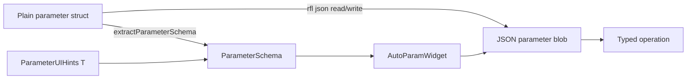

WhiskerToolbox uses registries to make an operation discoverable at runtime while
keeping its implementation in the library that owns it. The more recent registries
also treat the operation's parameter struct as a single source of truth for:

- defaults and validation;
- JSON serialization;
- runtime parameter metadata; and
- generated forms through `AutoParamWidget`.

This guide compares the main patterns currently in the repository. It is a design
guide for new work, not a replacement for the individual API references.

## The shared parameter stack

A registry does not by itself make parameters serializable or renderable. That
capability comes from the following stack:



Use a default-constructible, reflect-cpp-compatible parameter struct with default
member initializers. `rfl::Validator` constraints, `enum class` values, supported
vectors, and `rfl::TaggedUnion` alternatives are reflected into
`ParameterSchema`. A `ParameterUIHints<T>` specialization can add labels,
tooltips, groups, or dynamic combo-box behavior without putting Qt dependencies in
the computation library.

```cpp
struct ExampleParams {
    rfl::Validator<float, rfl::Minimum<0.0f>> threshold = 0.5f;
    bool enabled = true;
};

template<>
struct ParameterUIHints<ExampleParams> {
    static void annotate(ParameterSchema & schema) {
        schema.field("threshold")->tooltip = "Minimum accepted value";
    }
};
```

The registry should retain, or be able to recreate, both:

1. a JSON-to-`Params` adapter for execution; and
2. `extractParameterSchema<Params>()` for UI construction.

This avoids maintaining one list of fields for execution and another for a Qt
widget. See [ParameterSchema](../ParameterSchema/index.qmd) and
[Schema-Driven Forms](../ui/schema_driven_forms.qmd) for the full parameter and UI
interfaces.

::: {.callout-important}
`MLModelOperation::save()` and `load()` persist a trained model. They are not a
replacement for reflect-cpp serialization of a model's configuration parameters.
Keep trained-state persistence and parameter/state JSON as separate concerns.
:::

### Inheritance and reflect-cpp

Reflect-cpp works with inheritance only when the reflected fields are not split
between parent and child objects. A polymorphic parameter base with data members in
both the base and derived types is therefore a poor fit for automatic field
reflection. Prefer a plain standalone parameter struct at the registry boundary,
then adapt it to a runtime-polymorphic interface only when the computation API
requires that interface.

## Pattern comparison

| Pattern | Registration timing | Stored artifact | Parameter and UI path | Best fit |
|---|---|---|---|---|
| Legacy DataManager transforms | Constructor list | Live polymorphic operation | Separate `ParameterFactory` and custom widget | Existing legacy transform workflow |
| ML model registry | Constructor list | Factory for a fresh model | Polymorphic parameter base and manual panels | Stateful ML models with task filtering |
| TransformsV2 element registry | Static RAII | Typed transforms, metadata, executors, adapters | Automatic JSON adapters and lazy schema cache | Typed, composable data pipelines |
| Data synthesizer registry | Static RAII | JSON-facing generator function and metadata | Schema stored in generator metadata | Data creation from parameters alone |
| Command registry | Explicit startup dispatchers | JSON-facing command creator and metadata | Automatic JSON adapter and schema | Serializable, undoable data mutations |

The first two patterns predate the schema-driven system. They remain useful for
their current domains, but new UI-configurable operations should normally start
with the latter three patterns.

## Legacy DataManager transforms

[`TransformRegistry`](../../../src/DataManager/transforms/TransformRegistry.hpp)
is a runtime-constructed catalog of `TransformOperation` instances. Its
constructor in
[`TransformRegistry.cpp`](../../../src/DataManager/transforms/TransformRegistry.cpp)
explicitly creates every operation. The registry owns those instances and
precomputes a `std::type_index` to operation-name map, allowing the old transform
widget to offer operations compatible with the selected `DataTypeVariant`.

Parameters use a separate singleton,
[`ParameterFactory`](../../../src/DataManager/transforms/ParameterFactory.hpp).
Each setter is registered by transform name and parameter name. It converts a
`nlohmann::json` value, mutates a `TransformParametersBase` subclass, and can
resolve a DataManager key to a data object.

### Strengths

- The relationship between a legacy operation and its target `DataTypeVariant`
  type is direct.
- The registry has explicit operation ownership and does not rely on static
  initialization or force-linking.
- It supports legacy JSON pipeline replay and data-object references.

### Costs

- Adding a configurable operation often requires parallel edits: operation class,
  central `TransformRegistry.cpp` list, `ParameterFactory` setter registration,
  and a hand-written parameter-widget factory.
- JSON conversion, enum values, defaults, and UI constraints are duplicated across
  those layers.
- The string returned by `getName()` must match keys used by the parameter factory
  and widget factory.
- It exposes no `ParameterSchema`, so a generic form cannot be generated.

This pattern is maintained for the existing Data Transform widget. Do not extend
it for a new feature merely to reuse its UI unless the feature must participate in
that legacy workflow. See [Data Transform Widget](../ui/data_transform/data_transform_widget.qmd).

## ML model registry

[`MLModelRegistry`](../../../src/MLCore/models/MLModelRegistry.hpp) is another
runtime constructor list, but it stores factories rather than operation instances.
`registerModel<ModelT>()` creates a temporary prototype to obtain its display name
and task type, then stores a factory. Every `create()` call returns a fresh model,
which is essential because trained models have mutable state.

The registry supports querying by `MLTaskType`, so the ML UI can filter model
choices by classification, clustering, or dimensional-reduction workflow.
Algorithm-specific configuration is represented by subclasses of
`MLModelParametersBase` returned from `MLModelOperation::getDefaultParameters()`.

### Strengths

- Factory storage prevents accidental sharing of trained state between consumers.
- Task-type metadata supports simple, domain-specific model filtering.
- Registration is concise, explicit, and needs no linker-retention flags.
- The ML computation library remains independent of Qt.

### Costs

- Parameter types are accessed polymorphically, not through a uniform
  reflect-cpp JSON adapter.
- ML configuration panels create and read algorithm-specific Qt controls
  manually; adding a model can require a registry entry and UI panel work.
- `save()` and `load()` serialize trained model state only when an implementation
  supports it; they do not solve configuration JSON or form generation.

Use this pattern when a factory must produce independent, stateful model objects.
If ML parameter editing is modernized, add a plain reflect-cpp configuration struct
at the registry/UI boundary rather than trying to reflect the existing base-class
hierarchy. See [MLCore Models](../MLCore/models.qmd).

## TransformsV2 element registry

[`ElementRegistry`](../../../src/TransformsV2/core/ElementRegistry.hpp) is the
most capable registry in this comparison. A typed registration captures the input,
output, and parameter types:

```cpp
namespace {
auto const register_mask_area =
    RegisterTransform<Mask2D, float, MaskAreaParams>(
        "CalculateMaskArea",
        calculateMaskArea,
        {.description = "Calculate mask area", .category = "Image Processing"});
}
```

At registration, `ElementRegistry` records type metadata and a type-erased
transform. For the parameter type, it also installs a reflect-cpp JSON
deserializer, a type validator, and a schema factory. It creates typed executor
factories for dynamic pipeline execution, avoiding repeated parameter type dispatch
inside element loops. Variants of the helper cover stateless, binary,
time-grouped, and container transforms.

Schemas are created lazily when a caller requests one by transform name. The
TransformsV2 widget looks it up, uses `AutoParamWidget` by default, and can use a
`ParamWidgetRegistry` override for a specialized editor.

### Strengths

- One typed registration wires execution, metadata, parameter deserialization,
  and generated UI support.
- The registry understands input/output types and supports type-chain validation
  and pipeline composition.
- Typed executors preserve a type-erased public pipeline API without adding
  per-element casts.
- Custom widgets remain an escape hatch rather than the default path.

### Costs

- It has a large surface area because it supports several transform signatures,
  container lifting, lineage, contexts, and pipeline execution.
- File-scope registration objects require consumers to link the static library
  with platform-specific whole-archive behavior; otherwise the linker can discard
  registration translation units.
- Static initialization makes registration available early, but dependencies and
  duplicate names need careful review.

Use this pattern for a transform that must compose with typed pipeline steps or
needs discovery by compatible input/output type. See
[TransformsV2: Adding Transforms](../transforms_v2/adding_transforms.qmd).

## Data synthesizer registry

[`GeneratorRegistry`](../../../src/DataSynthesizer/GeneratorRegistry.hpp) is a
smaller static-registration design for generators that produce data from parameters
rather than transform input data. A file-local `RegisterGenerator<Params>` wraps a
typed function in a JSON-facing function, calls `extractParameterSchema<Params>()`,
and stores both the wrapper and `GeneratorMetadata`.

```cpp
namespace {
auto const register_sine_wave = RegisterGenerator<SineWaveParams>(
    "SineWave", generateSineWave,
    {.description = "Generate a sine wave",
     .category = "Periodic",
     .output_type = "AnalogTimeSeries"});
}
```

The widget queries output types and generator names, gets the selected generator's
schema, and passes it to `AutoParamWidget`. Generator state remains a generator key
plus a JSON parameter blob.

### Strengths

- A generator can own its parameter struct, implementation, metadata, and
  registration in one translation unit.
- The registry entry is intentionally small: name-to-function lookup plus
  output-type indexing and metadata.
- It has the same schema-driven UI and default-value behavior as TransformsV2
  without pipeline machinery.

### Costs

- It shares TransformsV2's static-registration and whole-archive linking
  requirement.
- It provides no built-in composition, type-chain resolution, or typed executor
  infrastructure.
- Duplicate generator names are rejected at runtime, so names should be treated
  as stable process-wide identifiers.

Use this pattern when an operation creates a `DataTypeVariant` from parameters (and
optional context) alone. See [Generator Registry](../DataSynthesizer/GeneratorRegistry.qmd).

## Command registry

[`CommandRegistry`](../../../src/Commands/Core/CommandRegistry.hpp) stores
JSON-facing command creators and `CommandInfo` metadata in a singleton. It avoids
static registration: each library exposes a `register_*_commands()` free function,
and every composition root explicitly invokes the dispatchers it needs.

`registerTypedCommand<CommandT, Params>()` is the bridge between the typed command
and the runtime catalog. It extracts `ParameterSchema`, normalizes numeric JSON,
deserializes with `rfl::DefaultIfMissing`, and creates the command object.

```cpp
registerTypedCommand<AdvanceFrame, AdvanceFrameParams>(
    reg, "AdvanceFrame",
    {.name = "AdvanceFrame",
     .description = "Advance the current frame",
     .category = "navigation"});
```

The Triage Session command editor obtains `CommandInfo` from the registry and gives
its embedded schema to `AutoParamWidget`.

### Strengths

- A typed registration call unifies command construction, default-aware JSON
  decoding, metadata, and generated UI schema.
- Explicit dispatchers avoid static-initialization-order problems and
  whole-archive linker flags.
- Domain libraries can register their own commands without a central factory
  switch statement.
- The core remains usable by the GUI, tests, and headless tools.

### Costs

- Every executable, test fixture, or other composition root must call the
  required dispatchers. Omitting one makes its commands unavailable.
- Registration names, `CommandInfo`, and a command's own identity remain a
  convention rather than a compile-time guarantee.
- UI hints must be visible in the registration translation unit before schema
  extraction, or the default empty hints specialization is used.

Use this pattern for named data mutations that should be serializable, undoable,
and discoverable by user-facing pipeline editors. See
[Command Registry](../Commands/command_registry.qmd).

## Selecting a pattern

Start with the smallest design that preserves the required ownership and discovery
semantics.

1. **One fixed configuration in one component:** no registry is required. Define a
   reflect-cpp parameter struct, extract its schema locally, and persist its JSON
   in the owning state.
2. **Named operations needed by several composition roots:** prefer an
   explicit-dispatcher typed registry like `CommandRegistry` when predictable
   startup and straightforward linking matter more than automatic discovery.
3. **Library-owned extensions that must be discovered without editing a central
   composition root:** use a static typed registry like `GeneratorRegistry`, and
   document/link the library with whole-archive retention.
4. **Typed pipeline composition, compatibility queries, or optimized dynamic
   execution:** use the richer `ElementRegistry` only when those capabilities are
   actual requirements.
5. **Stateful trained objects:** use a factory registry like `MLModelRegistry`;
   keep parameter-schema support as a separate adapter layer.

For all new schema-driven registries, use stable machine-facing keys for lookup and
separate display names in metadata. Persist the key plus a JSON parameter blob,
validate at the typed execution boundary, and keep Qt-specific annotations in
`ParameterUIHints` or a UI-facing library.

## Checklist for a new schema-driven operation

1. Define a plain parameter struct with defaults and reflect-cpp-compatible field
   types.
2. Add validators and a `ParameterUIHints<T>` specialization where the automatic
   schema needs more presentation information.
3. Select the registry according to the ownership, discovery, and composition
   requirements above.
4. Register a typed function/factory and metadata in the same library that owns
   the operation.
5. Verify that the registry makes both JSON deserialization and
   `ParameterSchema` available by key.
6. Use `AutoParamWidget` as the default editor; add a custom widget only for an
   interaction the generic form cannot express.
7. Persist the operation key and its parameters as JSON, then add a round-trip
   test for defaults and representative non-default values.
8. For static registrars, verify the application and relevant test targets retain
   their translation units during linking.

## Related documentation

- [ParameterSchema](../ParameterSchema/index.qmd)
- [Schema-Driven Forms](../ui/schema_driven_forms.qmd)
- [TransformsV2: Adding Transforms](../transforms_v2/adding_transforms.qmd)
- [Generator Registry](../DataSynthesizer/GeneratorRegistry.qmd)
- [Command Registry](../Commands/command_registry.qmd)
- [MLCore Models](../MLCore/models.qmd)
- [Data Transform Widget](../ui/data_transform/data_transform_widget.qmd)
