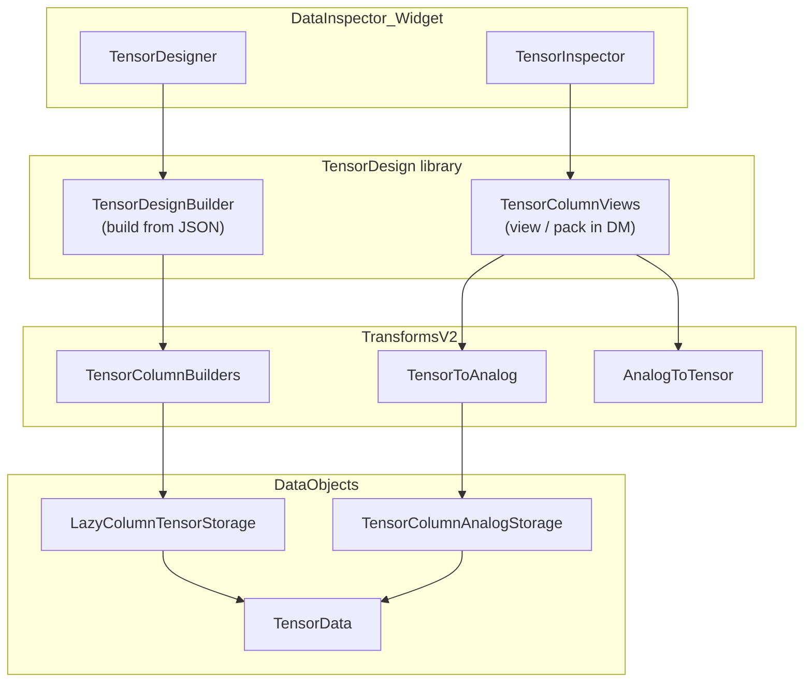

This page describes how the three main tensor workflows fit together: **building** lazy-column tensors from time-series sources, **packing** multi-channel analog data into dense tensors, and **viewing** tensor columns as zero-copy `AnalogTimeSeries`.

## Layered architecture



## Three directions

### 1. Build — lazy-column tensor from sources

**Use case:** Feature tables per interval, event, or timestamp row (e.g. mean curvature and spike count per contact interval).

| Layer | Responsibility |
|-------|----------------|
| [`TensorColumnBuilders`](transforms_v2/TensorColumnBuilders.qmd) | Build `ColumnProviderFn` per column from `ColumnRecipe` + pipeline |
| [`TensorDesign`](TensorDesign/TensorDesignBuilder.qmd) | Assemble row source, columns, invalidation → `TensorData` |
| `TensorDesigner` (UI) | Interactive column design; saves/loads JSON envelope |

```cpp
auto tensor = Neuralyzer::TensorDesign::buildTensorFromDesignJson(dm, json);
```

### 2. Pack — analog channels into dense tensor

**Use case:** Multi-channel acquisition (e.g. 32–384 ADC channels) stored as one `TensorData`.

| Layer | Responsibility |
|-------|----------------|
| [`AnalogToTensor`](transforms_v2/analog_to_tensor.qmd) | N `AnalogTimeSeries` → 1 dense `TensorData` |
| [`TensorColumnViews`](TensorDesign/TensorDesignBuilder.qmd#tensor-column-views) | Register packed tensor in `DataManager` |

```cpp
Neuralyzer::TensorDesign::populateTensorFromAnalogKeys(dm, "eeg", {"ch0", "ch1", "ch2"});
```

### 3. View — tensor columns as AnalogTimeSeries

**Use case:** Visualize or transform individual tensor columns in existing single-channel widgets.

| Layer | Responsibility |
|-------|----------------|
| [`TensorToAnalog`](transforms_v2/analog_to_tensor.qmd) | Extract columns as `AnalogTimeSeries` (zero-copy via `TensorColumnAnalogStorage`) |
| [`TensorColumnViews`](TensorDesign/TensorDesignBuilder.qmd#tensor-column-views) | Register views in `DataManager` under `{prefix}/{column_name}` |

```cpp
Neuralyzer::TensorDesign::createTensorColumnViews(dm, "eeg", "eeg/views", {});
```

## DataManager key conventions

- **Lazy-column tensors:** user-defined key via `TensorDesignSpec::tensor_key` or UI
- **Column views:** `{prefix}/{column_name}` (e.g. `eeg/views/ch0`)
- **Analog channel groups:** discovered by prefix before last `_` (e.g. `voltage_1`, `voltage_2` → group `voltage`)

## Tests by layer

| Layer | Test binary | Tags |
|-------|-------------|------|
| `TensorColumnBuilders` | `test_TransformsV2` | `[TensorColumnBuilders]` |
| `TensorDesign` build | `test_tensor_design` | `[TensorDesign]` |
| `TensorColumnViews` | `test_TransformsV2` | `[TensorColumnViews][TensorDesign]` |
| `TensorToAnalog` / `AnalogToTensor` | `test_TransformsV2` | algorithm tests in `AnalogToTensor.test.cpp` |
| Integration scenario | `test_TransformsV2`, `test_tensor_design` | `[whisker_contact]` |

## Related documentation

- [Multi-channel storage & transforms](DataObjects/multi_channel_storage_and_transforms.qmd)
- [TensorColumnAnalogStorage](DataObjects/AnalogTimeSeries/tensor_column_analog_storage.qmd)
- [Tensor Inspector (UI)](ui/data_inspectors/tensor_inspector.qmd)
- [Integration test scenarios](testing/test_scenarios.qmd)
