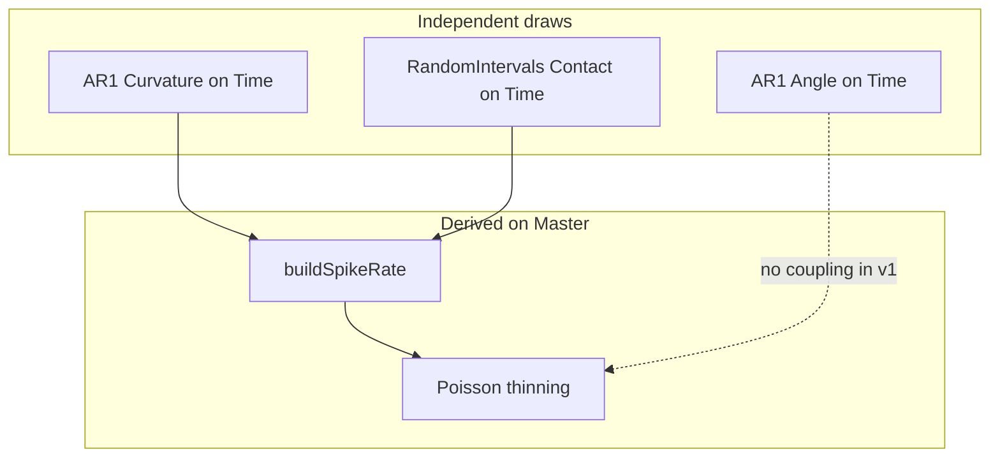

The **whisker-contact scenario** is a deterministic, seed-controlled `DataManager` fixture for integration tests that build tensors/tables from multi-timeframe neural and behavioral data.

It models a common analysis pattern: continuous whisker kinematics on a camera clock, spike trains on a high-rate master clock, and contact intervals that modulate firing — including extra modulation when curvature is high at contact onset.

## Motivation

Tensor and table workflows need richer fixtures than single linear analog signals or hand-placed intervals. This scenario provides:

- Two registered timeframes at realistic rates (500 Hz camera vs 30 kHz master)
- Correlated structure suitable for statistical assertions (TDD)
- Reproducibility via fixed seeds across `test_data_manager` and `test_TransformsV2`

It is implemented as **test-only fixtures** (not `DataSynthesizer` generators) to keep iteration fast; see [Integration test scenarios](../test_scenarios.qmd) for the general framework.

## Data model

| DataManager key | Type | TimeFrame | Description |
|-----------------|------|-----------|-------------|
| `Spikes` | `DigitalEventSeries` | `Master` | ~1 event / 30k samples baseline; elevated during contact |
| `Contact` | `DigitalIntervalSeries` | `Time` | Random intervals, mean duration ~10 camera frames |
| `Curvature` | `AnalogTimeSeries` | `Time` | Zero-mean AR(1) process |
| `Angle` | `AnalogTimeSeries` | `Time` | Zero-mean AR(1), independent of spikes in v1 |

### Timeframes

| TimeFrame key | Rate | Sample count (default 10 s) | Absolute times |
|---------------|------|----------------------------|----------------|
| `Master` | 30 kHz | 300,000 | `{0, 1, …, N-1}` |
| `Time` | 500 Hz | 5,000 | `{0, 60, 120, …}` (60 master ticks per frame) |

The child clock is built with `TimeFrameBuilder::withDerivedClock()`:

```cpp
TimeFrameBuilder().withDerivedClock(time_count, /*samples_per_parent_tick=*/60, 0)
```

## Generative model



### AR(1) analog signals

For `Curvature` and `Angle` on the `Time` clock:

$$
x[0] = \varepsilon[0],\quad x[t] = \phi\, x[t-1] + \varepsilon[t],\quad \varepsilon[t] \sim \mathcal{N}(0, \sigma^2)
$$

Defaults: $\phi = 0.9$, $\sigma = 0.436$ (marginal std $\approx 1$). Separate seeds `seed + 1` and `seed + 2`.

### Contact intervals

Exponential durations and gaps (same algorithm as `RandomIntervals` in DataSynthesizer), implemented in `fixtures/stochastic/RandomIntervals.hpp`:

- `mean_contact_duration_frames = 10`
- `mean_contact_gap_frames = 200` (seed `seed + 3`)

### Spike rate on Master

For each master sample $m$, camera frame $t = \lfloor m / 60 \rfloor$:

$$
\lambda(m) = \lambda_{\mathrm{bg}} + \lambda_{\mathrm{contact}}\,\mathbf{1}_{\mathrm{in\_contact}} + \lambda_\kappa\,\max(0, \kappa_{\mathrm{onset}})\,\mathbf{1}_{\mathrm{onset\_window}}
$$

- $\lambda_{\mathrm{bg}} = 1/30000$
- $\lambda_{\mathrm{contact}} = 50/30000$
- $\lambda_\kappa = 20/30000$
- $\kappa_{\mathrm{onset}}$ = curvature at the **start frame** of the active contact interval
- `onset_window` = first 60 master samples of each contact interval

Spikes are drawn via **Lewis–Shedler thinning** (`fixtures/stochastic/PoissonThinning.hpp`, seed `seed + 4`).

## Source files

| File | Role |
|------|------|
| `tests/DataManager/fixtures/scenarios/neural/WhiskerContactScenarioConfig.hpp` | Parameters and derived counts |
| `tests/DataManager/fixtures/scenarios/neural/WhiskerContactScenario.hpp` | `generate()` / `populate()` |
| `tests/DataManager/fixtures/scenarios/neural/WhiskerContactScenarioAssertions.hpp` | Statistical TDD helpers |
| `tests/DataManager/fixtures/whisker_contact_test_fixture.hpp` | Catch2 fixture |
| `tests/DataManager/fixtures/stochastic/*.hpp` | AR(1), intervals, rate builder, thinning |
| `tests/DataManager/test_whisker_contact_scenario.cpp` | Scenario unit / property tests |
| `tests/TransformsV2/test_tensor_whisker_contact_scenario.cpp` | Cross-timeframe tensor integration |

## Configuration

`WhiskerContactScenarioConfig` defaults (10 s episode):

```cpp
struct WhiskerContactScenarioConfig {
    double duration_sec = 10.0;
    int master_hz = 30000;
    int time_hz = 500;
    // keys: Master, Time, Spikes, Contact, Curvature, Angle
    float mean_contact_duration_frames = 10.0f;
    float mean_contact_gap_frames = 200.0f;
    float ar1_phi = 0.9f;
    float ar1_sigma = 0.436f;
    float baseline_spike_rate = 1.0f / 30000.0f;
    float contact_rate_boost = 50.0f / 30000.0f;
    float curvature_onset_rate_scale = 20.0f / 30000.0f;
    int onset_window_master_samples = 60;
    uint64_t seed = 42;
};
```

Increase `duration_sec` for statistical tests that need more contact intervals (e.g. 30 s in the property test case).

## Assertion helpers

`whisker_contact_assertions` namespace (`WhiskerContactScenarioAssertions.hpp`):

| Helper | Validates |
|--------|-----------|
| `assertScenarioStructure(dm, scenario)` | Keys exist on correct timeframes |
| `assertContactDuration(contact, expected, tol)` | Mean interval length ≈ 10 frames |
| `assertSpikeRateElevatedDuringContact(scenario, min_ratio)` | Firing rate higher during contact |
| `assertCurvatureOnsetModulation(scenario, min_spearman)` | Higher onset curvature → more onset-window spikes |
| `assertAR1Autocorrelation(signal, phi, tol)` | Lag-1 autocorrelation ≈ φ |

## Example: tensor per contact interval

`test_tensor_whisker_contact_scenario.cpp` builds a lazy tensor with:

- **Rows**: `Contact` intervals
- **Columns**: mean `Curvature`, spike count in interval (cross-timeframe via `buildIntervalPipelineProvider`)

```cpp
WhiskerContactTestFixture fixture(cfg);
auto mean_provider = buildIntervalPipelineProvider(
    fixture.dm(), "Curvature", scenario.contact, mean_pipeline);
auto spike_provider = buildIntervalPipelineProvider(
    fixture.dm(), "Spikes", scenario.contact, count_pipeline);
auto tensor = TensorData::createFromLazyColumns(...);
```

## Running tests

```bash
cmake --build --preset my-clang-release > build_log.txt 2>&1

out/build/Clang/Release/bin/test_data_manager "[whisker_contact]"
out/build/Clang/Release/tests/TransformsV2/test_TransformsV2 "[whisker_contact]"
```

Catch2 tags: `[whisker_contact]`, `[scenario]`, `[statistics]`, `[stochastic]`.

## Future extraction

When promoted to `DataSynthesizer`:

- `AR1Process` → `AutocorrelatedNoise` generator
- Rate assembly → context-aware interval-modulated rate generator
- `WhiskerContactScenario::populate` → `SynthesizeScenario` command (multi-signal)

Until then, the test fixture remains the source of truth for tensor/table integration tests.
