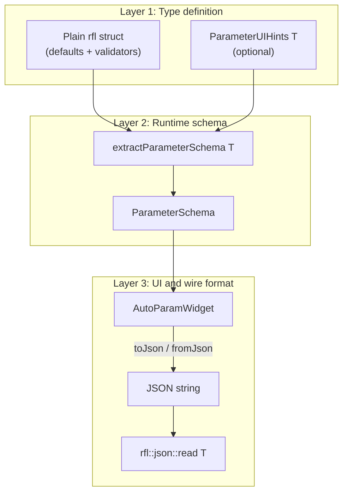
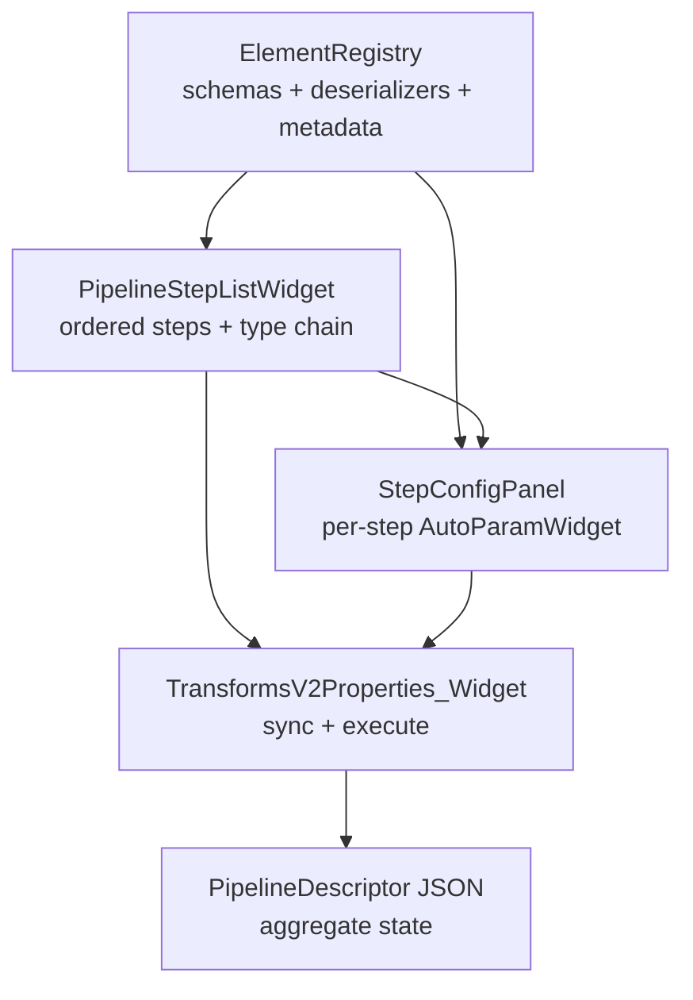

This guide explains how WhiskerToolbox turns plain C++ structs into Qt configuration
forms and JSON-serializable state. It covers the full stack — **reflect-cpp**,
**ParameterSchema**, and **AutoParamWidget** — and shows how two widgets consume the
same primitives at different levels of complexity:

- **Simple:** [PostEncoderWidget](../../src/WhiskerToolbox/DeepLearning_Widget/UI/Helpers/PostEncoderWidget.cpp) — one fixed struct, one form.
- **Complex:** [TransformsV2_Widget](../../src/WhiskerToolbox/TransformsV2_Widget/) — a runtime catalog of transforms composed into an ordered pipeline.

For API-level reference, see the dedicated docs linked throughout. This page is a
narrative walkthrough for developers adding or extending schema-driven UI.

## Related documentation

| Topic | Doc |
|-------|-----|
| Schema extraction API | [ParameterSchema Library](../ParameterSchema/index.qmd) |
| Qt form widget | [AutoParam System](autoparam.qmd) |
| Widget integration checklist | [Widget Development Guide](../WidgetDevelopment/index.qmd#parameter-schema) |
| TransformsV2 backend | [Transforms V2 Architecture](../transforms_v2/architecture.qmd) |
| DeepLearning widget structs | [Memory Frame Bindings](../DeepLearning/bindings/memory_frames.qmd) |

---

## The three-layer stack

Schema-driven forms separate **type definition**, **runtime schema**, and **UI /
wire format**. JSON is the interchange format at every boundary.



### Layer 1 — Define a plain struct

Use a reflect-cpp-compatible struct as the single source of truth for defaults,
validation, and serialization:

```cpp
struct MaskAreaParams {
    rfl::Validator<float, rfl::ExclusiveMinimum<0.0f>> scale_factor = 1.0f;
    rfl::Validator<float, rfl::Minimum<0.0f>> min_area = 0.0f;
    bool exclude_holes = false;
};
```

`rfl::Validator` constraints are extracted into `ParameterFieldDescriptor::min_value`
/ `max_value` at schema-build time. `enum class` fields auto-populate
`allowed_values`. `rfl::TaggedUnion` fields become variant combos with per-alternative
sub-schemas.

### Layer 1b — Optional UI hints

Specialize `ParameterUIHints<T>` to add tooltips, display names, dynamic-combo flags,
and grouping without polluting core library headers:

```cpp
template<>
struct ParameterUIHints<dl::SpatialPointModuleParams> {
    static void annotate(ParameterSchema & schema) {
        if (auto * f = schema.field("point_key")) {
            f->dynamic_combo = true;
            f->include_none_sentinel = true;
            f->tooltip = "DataManager key for PointData";
        }
    }
};
```

Keep hints in a separate header/TU when the params struct lives in a Qt-free library
(e.g. `PostEncoderParamSchemas.hpp` beside `DeepLearning/post_encoder/`).

::: {.callout-important}
Any translation unit that calls `extractParameterSchema<T>()` for a type with
`.cpp`-only hint specializations must include the hints header. Otherwise the
compiler instantiates the empty primary template and tooltips are silently missing.
:::

### Layer 2 — Extract a runtime schema

`extractParameterSchema<T>()` (in `ParameterSchema.hpp`) performs compile-time
reflection and returns a `ParameterSchema` containing `ParameterFieldDescriptor`
entries. The pipeline:

1. Enumerate fields via `rfl::fields<Params>()`
2. Default-construct params and `rfl::json::write` defaults per field
3. Parse `rfl::Validator` constraints from type strings
4. Detect `enum class`, `std::vector<T>`, and `rfl::TaggedUnion` via `rfl::to_view()`
5. Call `ParameterUIHints<T>::annotate(schema)`

### Layer 3 — Build UI and round-trip JSON

`AutoParamWidget::setSchema()` rebuilds the form. Edits emit `parametersChanged`.
Read back via JSON:

```cpp
// UI → typed struct
auto json_str = auto_param->toJson();
auto params = rfl::json::read<MyParams>(json_str).value();

// typed struct → UI
auto_param->fromJson(rfl::json::write(params));
```

`AutoParamWidget::toJson()` builds JSON manually; typed deserialization uses
`rfl::json::read<T>()` at the consumer boundary. This is intentional — the widget
stays domain-agnostic.

### Dynamic fields at runtime

Some combo values are not known until runtime (DataManager keys). Mark the field
with `dynamic_combo = true` in `ParameterUIHints`, then populate after `setSchema()`:

```cpp
auto keys = getKeysForTypes(*dm, {DM_DataType::Points});
auto_param->updateAllowedValues("point_key", keys);
```

See [AutoParam System](autoparam.qmd) for `updateVariantAlternatives()` and
`(None)` sentinel handling.

---

## Registry-driven consumer pattern: PostEncoderWidget

[PostEncoderWidget](../../src/WhiskerToolbox/DeepLearning_Widget/UI/Helpers/PostEncoderWidget.hpp)
uses a **runtime module catalog** (`PostEncoderModuleRegistry`) with a
`StepConfigPanel`-style UI: module combo + per-module `AutoParamWidget` loaded from
the registry schema. This is lighter than `ElementRegistry` but follows the same
`module_key` + `parameters_json` state model as TransformsV2 pipeline steps.

### Struct

`PostEncoderSlotParams` is a registry step descriptor (single step in Phase B):

```cpp
struct PostEncoderStepDescriptor {
    std::string module_key = "none";
    std::string parameters_json = "{}";
};
using PostEncoderSlotParams = PostEncoderStepDescriptor;
```

Defined in
[`SlotBindingTypes.hpp`](../../src/DeepLearning/bindings/SlotBindingTypes.hpp).

### Widget lifecycle

1. Populate module `QComboBox` from `PostEncoderModuleRegistry::moduleKeys()` plus
   a synthetic `(None)` entry.
2. On module change, load `getSchema(key)` into a fresh `AutoParamWidget` and
   `fromJson(parameters_json)`.
3. Connect `parametersChanged` → read `{module_key, parameters_json}` → apply to
   `DeepLearningState` and `SlotAssembler`.
4. Call `refreshDataSources()` to populate `point_key` when `spatial_point` is selected.

### When this pattern fits

- Module catalog may grow without editing widget-level tagged unions.
- Each module owns its schema and factory in the DeepLearning library.
- State serializes as JSON strings (ready for Phase C multi-step pipelines).

---

## Complex consumer pattern: TransformsV2_Widget

[TransformsV2_Widget](../../src/WhiskerToolbox/TransformsV2_Widget/) composes the
same primitives into a **runtime pipeline editor**. The user builds an ordered
sequence of transforms selected from a catalog; each step has its own parameter
blob.



### Registration layer (library startup)

Each transform registers at static init via `RegisterTransform<In, Out, Params>`:

```cpp
auto const reg = RegisterTransform<Mask2D, float, MaskAreaParams>(
    "CalculateMaskArea", calculateMaskArea, TransformMetadata{...});
```

`ElementRegistry` caches, per transform name:

| Cached artifact | Purpose |
|-----------------|---------|
| `ParameterSchema` | Feed `AutoParamWidget` |
| JSON deserializer | `rfl::json::read<Params>` at execution |
| Executor + pipeline factory | Build `TransformPipeline` |
| Metadata | Display name, description, input/output types |

The UI never calls `extractParameterSchema<T>()` directly — it looks up schema by
**transform name** at runtime.

### Pipeline composition (UI layer)

| Component | Role |
|-----------|------|
| `PipelineStepListWidget` | Ordered `PipelineStepEntry` vector; add/remove steps; type-chain highlighting |
| `StepConfigPanel` | Shows metadata + `AutoParamWidget` for the selected step's transform |
| `TransformsV2Properties_Widget` | Syncs UI ↔ `PipelineDescriptor` JSON; executes pipeline |
| `PipelineDescriptor` | Aggregate JSON: `steps[]`, optional `pre_reductions`, optional `range_reduction` |

Each step stores its parameters as a JSON string (`parameters_json`). The aggregate
descriptor is the workspace source of truth (`TransformsV2State::pipeline_json`).

### StepConfigPanel — multiplexing AutoParamWidget

When the user selects a step, `StepConfigPanel::showStepConfig()`:

1. Looks up transform metadata from `ElementRegistry`
2. Checks `ParamWidgetRegistry` for a custom widget override (by params type)
3. Otherwise creates a fresh `AutoParamWidget`, loads schema by transform name,
   and hydrates from `params_json`
4. Connects `parametersChanged` → emit updated JSON upstream

```cpp
auto const * schema = ElementRegistry::instance().getParameterSchema(transform_name);
_auto_param_widget = new AutoParamWidget(_scroll_content);
_auto_param_widget->setSchema(*schema);
_auto_param_widget->fromJson(params_json);
```

### Type-chain validation

`resolveTypeChain()` validates that each step's output type is compatible with the
next step's input — without running data. The available-transforms browser filters
to compatible successors, mirroring `TransformPipeline::execute()` logic.

### UI ↔ JSON sync

`buildJsonFromUI()` serializes the step list into `PipelineDescriptor`. A collapsible
JSON panel allows advanced edits (`pre_reductions`, `range_reduction`) that are not
yet fully exposed in dedicated UI panels. Manual JSON edits require **Apply** to
rebuild the step list.

### Simple vs complex — developer comparison

| Aspect | PostEncoderWidget | TransformsV2_Widget |
|--------|-------------------|---------------------|
| Param type | Fixed `PostEncoderSlotParams` | N types, chosen at runtime |
| Schema source | Local `extractParameterSchema<T>()` | `ElementRegistry::getParameterSchema(name)` |
| Serialized state | `PostEncoderSlotParams` in `DeepLearningState` | Full `pipeline_json` |
| Composition | Single `TaggedUnion` (one module) | Ordered `steps[]` vector |
| Validation | Implicit (variant choice) | Explicit type-chain between steps |
| Widget lifetime | One `AutoParamWidget` for widget life | New `AutoParamWidget` per step selection |

---

## PostEncoderWidget: gap analysis vs TransformsV2

`PostEncoderWidget` already adopts the schema-driven stack well. The gaps are in
**state modeling**, **composition**, and **registry infrastructure** — areas where
TransformsV2 went further.

### What PostEncoderWidget does well

- Registry-driven module discovery via `PostEncoderModuleRegistry`.
- Per-module schema forms via `AutoParamWidget` (StepConfigPanel pattern).
- `ParameterUIHints` for `point_key` dynamic combo on `SpatialPointModuleParams`.
- `module_key` + `parameters_json` round-trip through workspace JSON.

### Where it diverges

#### 1. ~~Split state model~~ (resolved in Phase A)

`DeepLearningState` stores `PostEncoderSlotParams` directly in
`DeepLearningStateData::post_encoder_params`.

#### 2. Backend supports pipelines; UI does not

`dl::PostEncoderPipeline` chains modules sequentially, but the widget still models a
**single** module step. Users cannot compose e.g. GlobalAvgPool → SpatialPoint.

#### 3. ~~No module registry~~ (resolved in Phase B)

`PostEncoderModuleRegistry` provides metadata, schemas, factories, and
`collapsesSpatialDims` for constraint enforcement. New modules register via
`RegisterPostEncoderModule<Params>` in their `.cpp` file.

#### 4. ~~Fragmented apply path~~ (resolved in Phase A/B)

`SlotAssembler::configurePostEncoderModule()` accepts `PostEncoderSlotParams`
(`module_key` + `parameters_json`) and delegates creation to the registry.

#### 5. Manual data-source refresh

`refreshDataSources()` must be called explicitly. Unlike patterns using
`DataSourceComboHelper` with DataManager observers, the combo does not auto-update
when keys are added or removed.

---

## Recommended improvements (phased)

These are design recommendations documented for future work. None are required to
use the current widget.

### Phase A — State alignment (implemented)

- `PostEncoderSlotParams` is embedded in `DeepLearningStateData` as
  `post_encoder_params`.
- `SlotAssembler::configurePostEncoderModule()` accepts a single typed params blob.

### Phase B — Registry pattern (implemented)

`PostEncoderModuleRegistry` (GeneratorRegistry-style, not full `ElementRegistry`):

- Each module registers with key, display name, description,
  `extractParameterSchema<Params>()`, factory lambda, and `collapses_spatial_dims`.
- `PostEncoderWidget` uses a runtime module combo + dynamic schema panel.
- State is `PostEncoderStepDescriptor` (`module_key` + `parameters_json`).
- Adding a module requires only library registration — no widget union edits.

### Phase C — Pipeline UI (larger effort)

Mirror TransformsV2 composition to unlock `PostEncoderPipeline`:

```cpp
struct PostEncoderPipelineDescriptor {
    std::vector<PostEncoderStepDescriptor> steps;
    // PostEncoderStepDescriptor: { module_key, parameters_json }
};
```

- Reuse or extract `PipelineStepListWidget` / `StepConfigPanel` patterns (or a slim
  `PostEncoderPipelineWidget`).
- Add shape-chain validation between sequential modules.
- Replace `configurePostEncoderModule(type, ...)` with
  `configurePostEncoderPipeline(descriptor)` building `dl::PostEncoderPipeline`.

### Phase D — Docs and tests

- Keep [post-encoder module docs](../DeepLearning/post_encoder_modules.qmd) and
  [helpers](DeepLearning_Widget/UI/Helpers/helpers.qmd) in sync with widget changes.
- Extend `PostEncoderWidget.test.cpp` for JSON-state round-trip once Phase A lands.

---

## Developer workflow checklist

Use this when adding schema-driven configuration to a new widget:

1. **Define** a plain `rfl` struct (or tagged union) with sensible defaults.
2. **Specialize** `ParameterUIHints<T>` for tooltips, combos, and dynamic fields.
3. **Extract** schema: `auto schema = extractParameterSchema<MyParams>();`
4. **Build** `AutoParamWidget`, call `setSchema(schema)`.
5. **Populate** dynamic combos after `setSchema()` if needed.
6. **Connect** `parametersChanged` → `rfl::json::read<MyParams>(toJson())` → apply.
7. **Persist** the struct as JSON in `EditorState` — avoid parallel flattened fields.
8. **Escalate** to registry + step-list patterns if users need runtime catalogs or
   ordered multi-step composition (see TransformsV2_Widget).

---

## See also

- [AutoParam System](autoparam.qmd) — widget API, type mapping, dynamic fields
- [ParameterSchema Library](../ParameterSchema/index.qmd) — field descriptors and extraction
- [Widget Development Guide § ParameterSchema](../WidgetDevelopment/index.qmd#parameter-schema)
- [DeepLearning Widget Helpers — PostEncoderWidget](DeepLearning_Widget/UI/Helpers/helpers.qmd#postencoderwidget)
- [Transforms V2 — Adding Transforms](../transforms_v2/adding_transforms.qmd)
