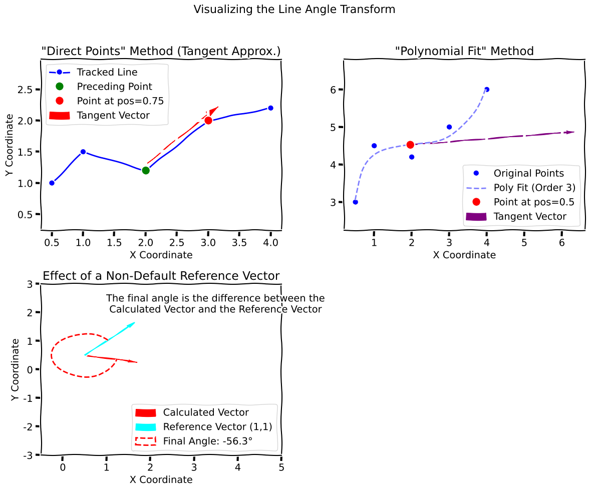

## Overview

This transform estimates the local orientation of a tracked polyline at each time, using a **midpoint** and **arc-length window** shared by both calculation modes, and reports the angle in a user-defined **measured X/Y** frame.

### Detailed Description

The Line Angle transform quantifies local orientation of a polyline in 2D for each time sample. You choose a **midpoint** along cumulative arc length (0 = first vertex, 1 = last), and a **window** width (also as a fraction of total arc length). The window is centered on the midpoint and **slides** so it always lies on the polyline (for example, near the tip a wide window shifts toward the base instead of extending past 100%).

Any fractional position is resolved with **linear interpolation between the two bracketing vertices** along the polyline (the same rule as arc-length interpolation elsewhere in the toolbox).

**Direct points** uses the **secant** between the interpolated endpoints of the window. **Polynomial fit** resamples inside that window, fits `x(u)` and `y(u)` in local parameter `u ∈ [0,1]`, and uses the **tangent** `(dx/du, dy/du)` from the polynomial coefficients evaluated at the midpoint’s local parameter.

Angles are reported in a **measured coordinate frame**: you supply world-space directions for positive measured X and positive measured Y. The implementation orthonormalizes (Gram–Schmidt) so that \(\hat{e}_x\) follows your X direction and \(\hat{e}_y\) is perpendicular, forming a right-handed basis. The output angle uses `atan2` in that basis (defaults match world +X / +Y).

There are two methods for calculating the angle:

-   **Direct Points:** Secant chord across the slid window, expressed in the measured basis.
-   **Polynomial Fit:** Local polynomial on the window; tangent from derivatives at the midpoint, same basis.



::: callout-note
The figure below (hidden in HTML builds) uses older schematic code (vertex-pair tangent and global polynomial). The implementation follows the windowed arc-length description above.
:::

::: {.content-hidden when-format="html"}
```{{python}}
#| echo: false
import numpy as np
import matplotlib.pyplot as plt

def get_line_points_for_tangent(line, position):
    # Ensure position is within [0, 1]
    position = np.clip(position, 0, 1)
    # Calculate the index, ensuring it's within the valid range
    end_point_index = int(position * (len(line) - 1))
    
    # Ensure index is at least 1 to have a preceding point
    if end_point_index == 0:
        end_point_index = 1
        
    start_point_index = end_point_index - 1
    
    start_point = line[start_point_index]
    end_point = line[end_point_index]
    
    return start_point, end_point


def get_tangent_vector(line, position, order):
    t = np.linspace(0, 1, len(line))
    x, y = line[:, 0], line[:, 1]

    # Fit polynomials
    px = np.polyfit(t, x, order)
    py = np.polyfit(t, y, order)

    # Derivatives
    pdx = np.polyder(px)
    pdy = np.polyder(py)

    # Tangent vector at position
    vx = np.polyval(pdx, position)
    vy = np.polyval(pdy, position)
    
    # Point at position
    point_x = np.polyval(px, position)
    point_y = np.polyval(py, position)
    
    return (point_x, point_y), (vx, vy)

with plt.xkcd():
    fig = plt.figure(figsize=(12, 10))
    gs = fig.add_gridspec(2, 2)
    ax1 = fig.add_subplot(gs[0, 0])
    ax2 = fig.add_subplot(gs[0, 1])
    ax3 = fig.add_subplot(gs[1, 0])
    fig.suptitle('Visualizing the Line Angle Transform', fontsize=16)


    # --- Plot 1: Direct Points Method ---
    line1 = np.array([[0.5, 1], [1, 1.5], [2, 1.2], [3, 2], [4, 2.2]])
    position1 = 0.75
    
    # Corrected logic for direct points tangent
    start_point1, end_point1 = get_line_points_for_tangent(line1, position1)

    ax1.plot(line1[:, 0], line1[:, 1], 'bo-', label='Tracked Line')
    ax1.plot(start_point1[0], start_point1[1], 'go', markersize=10, label='Preceding Point')
    ax1.plot(end_point1[0], end_point1[1], 'ro', markersize=10, label=f'Point at pos={position1}')
    ax1.arrow(start_point1[0], 
              start_point1[1] + 0.1, # slight offset for visibility
              end_point1[0] - start_point1[0], 
              end_point1[1] - start_point1[1],
              head_width=0.1, head_length=0.2, fc='red', ec='red', label='Tangent Vector')
    ax1.set_title('"Direct Points" Method (Tangent Approx.)')
    ax1.set_xlabel('X Coordinate')
    ax1.set_ylabel('Y Coordinate')
    ax1.legend()
    ax1.grid(True)
    ax1.axis('equal')

    # --- Plot 2: Polynomial Fit Method ---
    line2 = np.array([[0.5, 3], [1, 4.5], [2, 4.2], [3, 5], [4, 6]])
    position2 = 0.5
    order2 = 3
    point2, (vx, vy) = get_tangent_vector(line2, position2, order2)
    
    # Create smooth curve for plotting the fit
    t_smooth = np.linspace(0, 1, 100)
    x_smooth = np.polyval(np.polyfit(np.linspace(0, 1, len(line2)), line2[:, 0], order2), t_smooth)
    y_smooth = np.polyval(np.polyfit(np.linspace(0, 1, len(line2)), line2[:, 1], order2), t_smooth)

    ax2.plot(line2[:, 0], line2[:, 1], 'bo', label='Original Points')
    ax2.plot(x_smooth, y_smooth, 'b--', alpha=0.5, label=f'Poly Fit (Order {order2})')
    ax2.plot(point2[0], point2[1], 'ro', markersize=10, label=f'Point at pos={position2}')
    ax2.arrow(point2[0], point2[1], vx, vy,
              head_width=0.1, head_length=0.2, fc='purple', ec='purple', label=f'Tangent Vector')
    ax2.set_title('"Polynomial Fit" Method')
    ax2.set_xlabel('X Coordinate')
    ax2.legend()
    ax2.grid(True)
    ax2.axis('equal')
    
    # --- Plot 3: Reference Vector ---
    # Using the tangent from the direct method for this example
    line3 = np.array([[1, 0.5], [2, 1], [3, 0.8], [4, 1.2], [5, 1.5]])
    position3 = 0.6
    start_point3, end_point3 = get_line_points_for_tangent(line3, position3)
    vec_x, vec_y = end_point3[0] - start_point3[0], end_point3[1] - start_point3[1]
    
    ref_x, ref_y = 1, 1 # 45 degree reference
    
    # Plot angle vector and reference vector from a common point for clarity
    common_point = np.array([0.5, 0.5])
    ax3.arrow(common_point[0], common_point[1], vec_x, vec_y,
              head_width=0.1, head_length=0.2, fc='red', ec='red', label='Calculated Vector')
    ax3.arrow(common_point[0], common_point[1], ref_x, ref_y,
              head_width=0.1, head_length=0.2, fc='cyan', ec='cyan', label='Reference Vector (1,1)')
              
    angle_rad = np.arctan2(vec_y, vec_x)
    ref_angle_rad = np.arctan2(ref_y, ref_x)
    final_angle_rad = angle_rad - ref_angle_rad
    
    from matplotlib.patches import Arc
    angle_deg = np.rad2deg(ref_angle_rad)
    final_angle_deg = np.rad2deg(final_angle_rad)
    
    # Ensure final angle is in [-pi, pi] for correct arc drawing
    if final_angle_deg > 180: final_angle_deg -= 360
    if final_angle_deg < -180: final_angle_deg += 360

    arc = Arc(common_point, 1.5, 1.5, angle=angle_deg, theta1=0, theta2=final_angle_deg,
              color='red', linewidth=2, linestyle='--', label=f"Final Angle: {final_angle_deg:.1f}°")
    ax3.add_patch(arc)
    ax3.text(3.5, 2.0, "The final angle is the difference between the\nCalculated Vector and the Reference Vector", ha='center')


    ax3.set_title('Effect of a Non-Default Reference Vector')
    ax3.set_xlabel('X Coordinate')
    ax3.set_ylabel('Y Coordinate')
    ax3.legend(loc='lower right')
    ax3.grid(.0)
   # ax3.axis('equal')
    ax3.set_xlim(-0.5, 5)
    ax3.set_ylim(-3, 3)

    
    fig.tight_layout(rect=[0, 0, 1, 0.96])
    plt.show()


```
:::

### Neuroscience Use Cases

In neuroscience, this transform can be used to analyze a variety of data:

-   **Whisker Tracking:** The angle of a tracked whisker relative to the animal's head can be calculated to study sensory input and motor control.
-   **Limb Tracking:** The angle of a limb segment (e.g., the forearm) can be calculated to analyze reaching movements or other motor behaviors.
-   **Tongue Tracking:** The angle of the tongue during licking or other oral movements can be quantified.

## Parameters

This transform has the following parameters:

-   `position`: Fraction along cumulative arc length (0.0–1.0) for the **midpoint** where the angle is attributed.
-   `window`: Full width of the arc-length window (0.0–1.0), shared by both methods. A value of `0.2` with midpoint `0.2` nominally spans 10%–30% before sliding.
-   `method`: `Direct Points` (secant in the window) or `Polynomial Fit` (local fit in the window, tangent from coefficients).
-   `polynomial_order`: Polynomial degree when using `Polynomial Fit` (typical values 2–3).
-   `axis_x_x`, `axis_x_y`: World-vector direction of **positive measured X** (defaults `1`, `0`).
-   `axis_y_x`, `axis_y_y`: World-vector direction of **positive measured Y** (defaults `0`, `1`; orthogonalized to X).

## Example Configuration

Here is a complete example of a JSON configuration file that could be used to run this transformation. This example uses the midpoint at 50% of arc length, a 20% window, and the default world axes.

``` json
[
{
    "transformations": {
        "metadata": {
            "name": "Line Angle Pipeline",
            "description": "Test line angle calculation on line data",
            "version": "1.0"
        },
        "steps": [
            {
                "step_id": "1",
                "transform_name": "Calculate Line Angle",
                "phase": "analysis",
                "input_key": "test_line",
                "output_key": "line_angles",
                "parameters": {
                    "position": 0.5,
                    "window": 0.2,
                    "method": "Direct Points",
                    "polynomial_order": 3,
                    "axis_x_x": 1.0,
                    "axis_x_y": 0.0,
                    "axis_y_x": 0.0,
                    "axis_y_y": 1.0
                }
            }
        ]
    }
}
]
```
