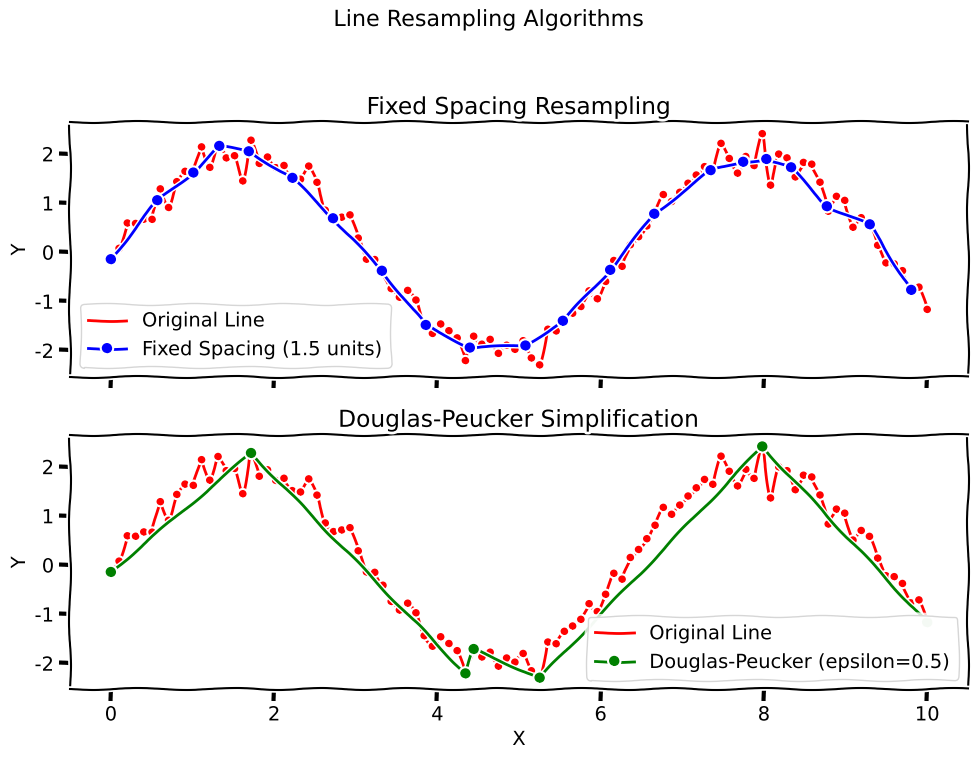

## Overview

This transform resamples a line to either simplify its geometry or to ensure it has points that are evenly spaced.

### Detailed Description

Line resampling is a common operation in data processing, used to either reduce the number of points in a line (simplification), smooth noisy geometry, or create a new line with a specific spacing between points. This transform provides three algorithms:

-   **Fixed Spacing**: This algorithm creates a new line with points that are a fixed distance apart. This is useful for standardizing the number of points in a line, or for preparing a line for further analysis that requires a uniform distribution of points.
-   **Douglas-Peucker**: This algorithm simplifies a line by removing points that are close to the line segment. This is useful for reducing the complexity of a line while preserving its overall shape.
-   **Polynomial Smooth**: Fits arc-length parametric polynomials to the line, then resamples the smoothed curve at the target spacing. Useful when the input line is noisy (for example from skeletonization or edge detection) but the overall shape should be preserved.



### Neuroscience Use Cases

In neuroscience, line resampling can be used in a variety of applications:

-   **Whisker Tracking**: When tracking the movement of a whisker, the output is often a line with a variable number of points. Resampling the line to a fixed number of points can be useful for standardizing the data for further analysis, such as calculating the curvature or angle of the whisker over time.
-   **Dendrite Tracing**: When tracing the path of a dendrite from a neuron, the resulting line can be very complex. The Douglas-Peucker algorithm can be used to simplify the line, making it easier to visualize and analyze the overall shape of the dendrite.
-   **Animal Tracking**: When tracking the path of an animal in an open field, the resulting line can be very long and detailed. Resampling the line can help to smooth out the path and reduce the amount of data that needs to be processed.

## Parameters

This transform has the following parameters:

-   `algorithm`: The resampling algorithm to use. This can be one of the following:
    -   `FixedSpacing` (V1 UI: `Fixed Spacing`): Resamples the line to have points that are a fixed distance apart.
    -   `DouglasPeucker` (V1 UI: `Douglas-Peucker`): Simplifies the line using the Douglas-Peucker algorithm.
    -   `PolynomialSmooth` (V1 UI: `Polynomial Smooth`; V2 JSON: `PolynomialSmooth`): Smooths via parametric polynomial fitting, then resamples.
-   `target_spacing`: The desired distance between points in the resampled line. Used for `FixedSpacing` and `PolynomialSmooth`.
-   `epsilon`: The tolerance for the Douglas-Peucker algorithm. Used only when the `algorithm` is set to `DouglasPeucker`. A larger value of epsilon will result in a more simplified line.
-   `polynomial_order`: Polynomial order for `PolynomialSmooth` (typically 1–9, default 3). Requires at least `polynomial_order + 1` input points for fitting.

## Example Configuration

Here is a complete example of a JSON configuration file that could be used to run this transformation. This example smooths a noisy line with polynomial fitting and resamples at 5 pixel spacing (Transforms V2 / pipeline JSON uses `method`; V1 DataManager transform uses `algorithm` with display strings such as `Polynomial Smooth`).

``` json
[
    {
        "transformations": {
            "metadata": {
                "name": "Line Resample Pipeline",
                "description": "Test line resampling on line data",
                "version": "1.0"
            },
            "steps": [
                {
                    "step_id": "1",
                    "transform_name": "Resample Line",
                    "phase": "analysis",
                    "input_key": "test_lines",
                    "output_key": "resampled_lines",
                    "parameters": {
                        "algorithm": "Polynomial Smooth",
                        "target_spacing": 5.0,
                        "polynomial_order": 3,
                        "epsilon": 2.0
                    }
                }
            ]
        }
    }
]
```

::: {.content-hidden when-format="html"}
```{{python}}
#| echo: false
import numpy as np
import matplotlib.pyplot as plt

def resample_line_fixed_spacing(points, spacing):
    if len(points) < 2:
        return points

    resampled_points = [points[0]]
    dist_since_last = 0.0

    for i in range(len(points) - 1):
        p1 = points[i]
        p2 = points[i+1]

        segment_vec = p2 - p1
        segment_len = np.linalg.norm(segment_vec)
        if segment_len == 0:
            continue
        segment_dir = segment_vec / segment_len

        current_pos_on_segment = 0.0

        while current_pos_on_segment < segment_len:
            dist_to_next_sample = spacing - dist_since_last

            if current_pos_on_segment + dist_to_next_sample < segment_len:
                new_point = p1 + segment_dir * (current_pos_on_segment + dist_to_next_sample)
                resampled_points.append(new_point)
                dist_since_last = 0.0
                current_pos_on_segment += dist_to_next_sample
            else:
                dist_since_last += segment_len - current_pos_on_segment
                break

    return np.array(resampled_points)

def douglas_peucker(points, epsilon):
    if len(points) < 3:
        return points

    dmax = 0.0
    index = 0
    end = len(points) - 1

    for i in range(1, end):
        d = perpendicular_distance(points[i], points[0], points[end])
        if d > dmax:
            index = i
            dmax = d

    if dmax > epsilon:
        rec_results1 = douglas_peucker(points[:index+1], epsilon)
        rec_results2 = douglas_peucker(points[index:], epsilon)

        return np.vstack((rec_results1[:-1], rec_results2))
    else:
        return np.array([points[0], points[end]])

def perpendicular_distance(point, line_start, line_end):
    if np.all(line_start == line_end):
        return np.linalg.norm(point - line_start)
    return np.abs(np.cross(line_end - line_start, line_start - point)) / np.linalg.norm(line_end - line_start)


# Use xkcd style for the plot
with plt.xkcd():
    # --- Generate sample data ---
    t = np.linspace(0, 2 * np.pi, 100)
    x = np.linspace(0, 10, 100)
    y = 2 * np.sin(x) + np.random.normal(0, 0.2, 100)
    original_line = np.array(list(zip(x,y)))


    # --- Resample data ---
    fixed_spacing_line = resample_line_fixed_spacing(original_line, 1.5)
    douglas_peucker_line = douglas_peucker(original_line, 0.5)


    # --- Create the plots ---
    fig, (ax1, ax2) = plt.subplots(2, 1, figsize=(10, 8), sharex=True, sharey=True)
    fig.suptitle('Line Resampling Algorithms', fontsize=16)

    # Plot 1: Fixed Spacing
    ax1.plot(original_line[:, 0], original_line[:, 1], 'r-', label='Original Line')
    ax1.plot(original_line[:, 0], original_line[:, 1], 'ro', markersize=4)
    ax1.plot(fixed_spacing_line[:, 0], fixed_spacing_line[:, 1], 'bo-', label='Fixed Spacing (1.5 units)')
    ax1.set_title('Fixed Spacing Resampling')
    ax1.set_ylabel('Y')
    ax1.legend()
    ax1.grid(True)

    # Plot 2: Douglas-Peucker
    ax2.plot(original_line[:, 0], original_line[:, 1], 'r-', label='Original Line')
    ax2.plot(original_line[:, 0], original_line[:, 1], 'ro', markersize=4)
    ax2.plot(douglas_peucker_line[:, 0], douglas_peucker_line[:, 1], 'go-', label='Douglas-Peucker (epsilon=0.5)')
    ax2.set_title('Douglas-Peucker Simplification')
    ax2.set_xlabel('X')
    ax2.set_ylabel('Y')
    ax2.legend()
    ax2.grid(True)

    plt.tight_layout(rect=[0, 0.03, 1, 0.95])
    plt.show()
```
:::
